# WikiStream: Real-Time Wikipedia Edit Analytics Platform

A streaming data pipeline that captures live Wikipedia edits from Wikimedia EventStreams, processes them through a medallion architecture, and surfaces insights for content monitoring and risk detection.

**Tech Stack:** Amazon MSK (KRaft 3.9.x) · EMR Serverless (Spark 3.5) · AWS Step Functions · Amazon S3 Tables (Iceberg 1.10.0) · ECS Fargate · AWS Deequ  
**Deployment:** AWS Cloud (us-east-1) · Terraform 1.6+

> 📐 **For detailed architecture diagrams and component breakdown, see [docs/ARCHITECTURE.md](docs/ARCHITECTURE.md)**

---

## Table of Contents

1. [Business Problem](#business-problem)
2. [Solution Overview](#solution-overview)
3. [Architecture](#architecture)
4. [Data Model](#data-model)
5. [Technology Choices](#technology-choices)
6. [Cost Estimation](#cost-estimation)
7. [Quick Start](#quick-start)
8. [Project Structure](#project-structure)

---

## Business Problem

### The Data Source

Wikimedia operates one of the largest collaborative platforms globally:

| Metric | Value |
|--------|-------|
| Wikipedia editions | 300+ languages |
| Edits per minute | ~500-700 (peak: 1,500+) |
| Monthly active editors | 280,000+ |
| Bot edits | ~20-30% of total |

**Wikimedia EventStreams** provides real-time Server-Sent Events (SSE) of all edits across all Wikimedia projects.

### The Use Cases

| Use Case | Description | Value |
|----------|-------------|-------|
| **Content Monitoring** | Track edit velocity, top contributors, trending pages | Understand community activity |
| **Vandalism Detection** | Identify suspicious edit patterns (rapid edits, large deletions) | Protect content quality |
| **Regional Analysis** | Compare activity across language editions | Geographic insights |
| **Bot Activity Tracking** | Monitor automated vs human contributions | Community health |

### Target Domains

We filter events from high-activity Wikipedia editions:

```
HIGH_ACTIVITY: en, de, ja, fr, zh, es, ru
REGIONAL: asia_pacific, europe, americas, middle_east
```

---

## Solution Overview

WikiStream implements the **Medallion Architecture** (Bronze → Silver → Gold) for progressive data refinement using **Apache Iceberg** format on **S3 Tables**:

```mermaid
flowchart LR
    subgraph Sources["📡 Source"]
        WM["Wikipedia<br/>EventStreams"]
    end

    subgraph Ingestion["📥 Ingestion"]
        ECS["ECS Fargate<br/>Producer"]
        MSK["Amazon MSK<br/>Kafka 3.9.x"]
    end

    subgraph Processing["⚡ EMR Serverless"]
        BRONZE["🥉 Bronze<br/>Streaming"]
        SILVER["🥈 Silver<br/>Batch"]
        DQ["🔍 Data Quality"]
        GOLD["🥇 Gold<br/>Batch"]
    end

    subgraph Storage["💾 S3 Tables"]
        ICE["Apache Iceberg<br/>Tables"]
    end

    WM -->|SSE| ECS
    ECS -->|Produce| MSK
    MSK -->|30s micro-batch| BRONZE
    BRONZE --> ICE
    ICE --> SILVER
    SILVER --> ICE
    ICE --> DQ
    ICE --> GOLD
    GOLD --> ICE
```



### Processing Flow

| Layer | Job Type | Trigger | Description |
|-------|----------|---------|-------------|
| **Bronze** | Streaming | 30s micro-batches | Kafka → Iceberg with exactly-once semantics |
| **Silver** | Batch | Every 5 min (Step Functions) | Deduplication, normalization, enrichment |
| **Data Quality** | Batch | Every 5 min (Step Functions) | Deequ validation: completeness, validity |
| **Gold** | Batch | Every 5 min (Step Functions) | Aggregations: hourly stats, entity trends, risk scores |

### Key Features

- **≤30 second** Bronze ingestion latency
- **≤5 minute** end-to-end SLA for dashboard freshness
- **Exactly-once semantics** via Spark checkpointing and idempotent MERGE
- **Auto-recovery** Lambda restarts Bronze job on health check failure
- **Data quality gates** with Deequ before Gold layer updates

---

## Architecture

> 📐 **See [docs/ARCHITECTURE.md](docs/ARCHITECTURE.md) for detailed architecture diagrams, component breakdown, and data flow visualizations.**

### High-Level Components

```
┌─────────────────────────────────────────────────────────────────────────────┐
│                              WikiStream Pipeline                             │
└─────────────────────────────────────────────────────────────────────────────┘

  INGESTION              STREAMING              PROCESSING           STORAGE
┌────────────┐        ┌────────────┐        ┌────────────────┐    ┌──────────┐
│ Wikipedia  │        │  Amazon    │        │ EMR Serverless │    │ S3 Tables│
│ SSE Feed   │──────▶│   MSK      │──────▶│                │───▶│ (Iceberg)│
└────────────┘        │  (Kafka)   │        │ Bronze→Silver  │    │          │
      │               └────────────┘        │ →DQ→Gold       │    │ bronze   │
      ▼                                     └────────────────┘    │ silver   │
┌────────────┐                                     │              │ gold     │
│ECS Fargate │                                     ▼              └──────────┘
│ Producer   │                              ┌────────────┐
└────────────┘                              │   Step     │
                                            │ Functions  │
                                            └────────────┘
```

### System Components

| Component | Service | Description |
|-----------|---------|-------------|
| **Data Source** | Wikipedia EventStreams | Real-time SSE feed |
| **Producer** | ECS Fargate | Python Kafka producer with IAM auth |
| **Message Broker** | Amazon MSK (KRaft 3.9.x) | 2 brokers, topics: `raw-events`, `dlq-events` |
| **Processing** | EMR Serverless (Spark 3.5) | Bronze streaming + Silver/Gold batch |
| **Storage** | S3 Tables (Iceberg 1.10.0) | Medallion architecture tables |
| **Orchestration** | Step Functions + EventBridge | Unified batch pipeline |
| **Auto-Recovery** | Lambda + CloudWatch | Bronze job health monitoring |
| **Monitoring** | CloudWatch + SNS | Dashboard, metrics, alerts |

---

## Data Model

### Wikimedia Event Schema

Sample event from `stream.wikimedia.org/v2/stream/recentchange`:

```json
{
  "meta": {
    "id": "c3b60285-58c0-493e-ad60-ddab7732fcc4",
    "domain": "en.wikipedia.org",
    "dt": "2025-01-01T10:00:00Z"
  },
  "type": "edit",
  "title": "Example_Article",
  "user": "Editor123",
  "bot": false,
  "length": {"old": 1000, "new": 1050},
  "revision": {"old": 123456, "new": 123457}
}
```

### Medallion Tables


### Risk Score Explained

The `gold.risk_scores` table identifies potentially problematic edit patterns:

| Risk Factor | Threshold | Points |
|-------------|-----------|--------|
| High edit velocity | >50 edits/hour | 40 |
| Large deletions | >3 large deletions | 30 |
| Anonymous activity | >50% anonymous | 20 |
| Cross-domain activity | >5 domains + high velocity | 10 |

**Risk Levels:**
- **HIGH** (70-100): Immediate attention needed
- **MEDIUM** (40-69): Monitor closely
- **LOW** (0-39): Normal activity

### Partitioning Strategy

| Layer | Partition Columns | Rationale |
|-------|-------------------|-----------|
| **Bronze** | `(event_date, event_hour)` | Streaming micro-batches need time-based partitioning |
| **Silver** | `(event_date)` | Date-based for efficient time-range queries |
| **Gold** | `(stat_date)` | Daily aggregations |

---

## Technology Choices

| Component | Service | Why This Choice |
|-----------|---------|-----------------|
| **Message Queue** | Amazon MSK (KRaft 3.9.x) | Kafka without Zookeeper complexity. Native AWS IAM auth. |
| **Stream Producer** | ECS Fargate | Long-running SSE consumer. Pay-per-second, no server management. |
| **Bronze Processing** | EMR Serverless (Streaming) | Spark Structured Streaming with exactly-once semantics. Auto-restart via Lambda. |
| **Silver/Gold Processing** | EMR Serverless (Batch) | Zero idle cost. Pay only during job execution. Auto-scaling Spark. |
| **Table Format** | S3 Tables (Iceberg 1.10.0) | AWS-managed Iceberg with ACID transactions, time-travel, automatic compaction. |
| **Data Quality** | AWS Deequ 2.0.7 | Native Spark integration. Completeness, validity, uniqueness checks. |
| **Orchestration** | Step Functions + EventBridge | Serverless. Unified batch pipeline (Silver → DQ → Gold) |
| **Auto-Recovery** | Lambda | Restarts Bronze job on CloudWatch alarm trigger |

### Why Not...?

| Alternative | Reason Not Used |
|-------------|-----------------|
| MSK Serverless | Less control over configuration; provisioned is more predictable |
| MWAA (Airflow) | $250+/month minimum; Step Functions is 90% cheaper |
| Lambda for Producer | 15-minute timeout; SSE stream requires continuous connection |
| Kinesis | MSK provides more flexibility with Kafka ecosystem |
| All Streaming | Silver/Gold transformations don't benefit from streaming; batch is more cost-effective |
| dbt | Adds operational complexity. Native Spark SQL + Step Functions provides equivalent functionality |

---

## Cost Estimation

### Monthly Cost (Dev/Portfolio)

| Service | Configuration | Est. Cost |
|---------|---------------|-----------|
| MSK | 2× kafka.t3.small, 50GB each | ~$90 |
| ECS Fargate | 0.25 vCPU, 0.5GB, 24/7 (Producer) | ~$10 |
| EMR Serverless - Bronze | Streaming job, pre-warmed workers | ~$100 |
| EMR Serverless - Silver/Gold | Batch jobs via Step Functions | ~$15 |
| S3 Tables + S3 | ~10 GB storage | ~$3 |
| NAT Gateway | Single AZ | ~$35 |
| Step Functions + Lambda | Orchestration + auto-restart | ~$2 |
| CloudWatch | Logs + Metrics | ~$5 |
| **Total (24/7)** | | **~$260/month** |

### Cost Optimization Scripts

For development, use the provided scripts to destroy/recreate costly infrastructure:

```bash
# End of day - saves ~$19/day by destroying NAT, MSK, EMR
./scripts/destroy_infra.sh

# Start of day - recreates infrastructure (~25-35 min)
./scripts/create_infra.sh
```

**Preserved during destroy:** S3 buckets, S3 Tables (your data), ECR images, Terraform state

---

## Quick Start

### Prerequisites

```bash
aws --version          # AWS CLI v2.x required
terraform --version    # Terraform >= 1.6.0
docker --version       # Docker for building images
```

### Deploy

```bash
# 1. Setup Terraform backend (first time only)
./scripts/setup_terraform_backend.sh

# 2. Deploy infrastructure
cd infrastructure/terraform
terraform init
terraform apply

# 3. Build and push producer image
ECR_URL=$(terraform output -raw ecr_repository_url)
aws ecr get-login-password --region us-east-1 | docker login --username AWS --password-stdin $(echo $ECR_URL | cut -d'/' -f1)
cd ../../producer
docker build --platform linux/amd64 -t ${ECR_URL}:latest .
docker push ${ECR_URL}:latest

# 4. Upload Spark jobs
DATA_BUCKET=$(terraform -chdir=../infrastructure/terraform output -raw data_bucket)
aws s3 sync ../spark/jobs/ s3://${DATA_BUCKET}/spark/jobs/

# 5. Start services
./scripts/create_infra.sh  # Starts ECS producer + Bronze streaming job
```

### Verify Pipeline

```bash
# Check EMR jobs
EMR_APP_ID=$(terraform -chdir=infrastructure/terraform output -raw emr_serverless_app_id)
aws emr-serverless list-job-runs --application-id ${EMR_APP_ID} --output table

# Check producer logs
aws logs tail /ecs/wikistream-dev-producer --follow --since 5m

# Check Step Functions executions
aws stepfunctions list-executions \
  --state-machine-arn $(terraform -chdir=infrastructure/terraform output -raw batch_pipeline_state_machine_arn) \
  --max-results 5
```

---

## Project Structure

```
wikistream/
├── README.md                          # This file
├── docs/
│   ├── ARCHITECTURE.md                # Detailed architecture documentation
│   └── architecture_diagram.html      # Interactive HTML diagram
├── infrastructure/
│   └── terraform/
│       ├── main.tf                    # AWS resources (VPC, MSK, EMR, ECS, Step Functions)
│       └── variables.tf               # Configuration variables
├── producer/
│   ├── kafka_producer.py              # SSE consumer → Kafka producer
│   ├── requirements.txt               # Python dependencies
│   └── Dockerfile                     # Container image for ECS
├── spark/
│   ├── jobs/
│   │   ├── bronze_streaming_job.py    # Kafka → Bronze (Spark Structured Streaming)
│   │   ├── silver_batch_job.py        # Bronze → Silver (Spark Batch)
│   │   ├── gold_batch_job.py          # Silver → Gold (Spark Batch)
│   │   └── data_quality_job.py        # Deequ quality checks
│   └── schemas/
│       ├── bronze_schema.py           # Raw event schema
│       ├── silver_schema.py           # Cleaned event schema
│       └── gold_schema.py             # Aggregation schemas
├── config/
│   └── settings.py                    # Domain filters, regions, SLAs
├── scripts/
│   ├── setup_terraform_backend.sh     # Setup S3 + DynamoDB for state
│   ├── create_infra.sh                # Start infrastructure + pipeline
│   ├── destroy_infra.sh               # Stop costly resources (preserves data)
│   └── deploy.sh                      # Full deployment script
├── monitoring/
│   ├── grafana/dashboards/            # Grafana dashboard exports
│   └── cloudwatch/alarms.json         # CloudWatch alarm definitions
└── quicksight/
    ├── datasets/                      # QuickSight dataset configs
    └── dashboards/                    # Dashboard definitions
```

---

## Implementation Status

| Component | Status | Notes |
|-----------|--------|-------|
| **ECS Kafka Producer** | ✅ Implemented | Python, IAM auth, DLQ support |
| **MSK Cluster (KRaft)** | ✅ Implemented | Kafka 3.9.x, 2 brokers |
| **Bronze Streaming Job** | ✅ Implemented | 30s micro-batches, MERGE INTO |
| **Silver Batch Job** | ✅ Implemented | Deduplication, normalization |
| **Gold Batch Job** | ✅ Implemented | Aggregations, risk scores |
| **Data Quality (Deequ)** | ✅ Implemented | Completeness, validity checks |
| **Step Functions Pipeline** | ✅ Implemented | Unified: Silver → DQ → Gold |
| **Auto-Restart Lambda** | ✅ Implemented | CloudWatch alarm trigger |
| **CloudWatch Dashboard** | ✅ Implemented | Pipeline health metrics |
| **SNS Alerts** | ✅ Implemented | Failure notifications |
| **S3 Tables (Iceberg)** | ✅ Implemented | bronze, silver, gold namespaces |
| **Cost Optimization Scripts** | ✅ Implemented | destroy/create for dev workflow |

---

## Author

Built as a portfolio project demonstrating modern data engineering on AWS.

**Skills Demonstrated:**
- Real-time streaming with Kafka (MSK KRaft 3.9.x)
- Apache Iceberg 1.10.0 on S3 Tables
- Serverless Spark (EMR Serverless 7.12.0)
- Infrastructure as Code (Terraform)
- Medallion Architecture (Bronze streaming, Silver/Gold batch)
- Data Quality (AWS Deequ)
- Self-healing infrastructure (Lambda auto-restart)
- Cost-optimized dev workflow
