# WikiStream: Real-Time Wikipedia Edit Analytics Platform

A streaming data pipeline that captures live Wikipedia edits from Wikimedia EventStreams, processes them through a medallion architecture, and surfaces insights via dashboards for content monitoring and risk detection.

**Tech Stack:** Amazon MSK (KRaft) · EMR Serverless · AWS Step Functions · Amazon S3 Tables (Iceberg) · ECS Fargate · Amazon QuickSight · Grafana  
**Deployment:** AWS Cloud (us-east-1)

---

## Table of Contents

1. [Business Problem](#business-problem)
2. [Solution Overview](#solution-overview)
3. [Architecture](#architecture)
4. [Data Model](#data-model)
5. [Technology Choices](#technology-choices)
6. [Cost Estimation](#cost-estimation)
7. [Runbook](#runbook)
8. [Project Structure](#project-structure)

---

## Business Problem

### The Data Source

Wikimedia operates one of the largest collaborative platforms globally:

| Metric | Value |
|--------|-------|
| Wikipedia editions | 300+ languages |
| Edits per minute | ~500-700 (peak: 1,500+) |
| Monthly active editors | 280,000+ |
| Bot edits | ~20-30% of total |

**Wikimedia EventStreams** provides real-time Server-Sent Events (SSE) of all edits across all Wikimedia projects.

### The Use Cases

| Use Case | Description | Value |
|----------|-------------|-------|
| **Content Monitoring** | Track edit velocity, top contributors, trending pages | Understand community activity |
| **Vandalism Detection** | Identify suspicious edit patterns (rapid edits, large deletions) | Protect content quality |
| **Regional Analysis** | Compare activity across language editions | Geographic insights |
| **Bot Activity Tracking** | Monitor automated vs human contributions | Community health |

### Target Domains

We filter events from high-activity Wikipedia editions:

```
HIGH_ACTIVITY: en, de, ja, fr, zh, es, ru
REGIONAL: asia_pacific, europe, americas, middle_east
```

---

## Solution Overview

WikiStream implements the **Medallion Architecture** (Bronze → Silver → Gold) for progressive data refinement using **Apache Iceberg V3** format with deletion vectors and row lineage support:

```mermaid
flowchart TB
    subgraph Sources["Data Source"]
        WM[("Wikimedia\nEventStreams\nSSE")]
    end

    subgraph Ingestion["Ingestion Layer"]
        ECS["ECS Fargate\nProducer"]
        MSK["Amazon MSK\n(KRaft)"]
        DLQ["DLQ Topic"]
    end

    subgraph Processing["Processing Layer (EMR Serverless)"]
        BRONZE_JOB["Bronze Streaming Job\n(Spark Structured Streaming)\n⚡ Continuous"]
        SILVER_JOB["Silver Batch Job\n(Scheduled every 5 min)"]
        GOLD_JOB["Gold Batch Job\n(Scheduled every 5 min)"]
        DQ_JOB["Data Quality Job\n(Deequ, every 15 min)"]
    end

    subgraph Storage["Storage Layer (S3 Tables / Iceberg v3)"]
        Bronze[("Bronze\nraw_events\n📦 Parquet")]
        Silver[("Silver\ncleaned_events\n📦 Parquet")]
        Gold[("Gold\nhourly_stats\nrisk_scores\n📦 Parquet")]
    end

    subgraph Orchestration["Orchestration"]
        LAMBDA["Lambda\n(Bronze Auto-Restart)"]
        SFN_S["Step Functions\n(Silver)"]
        SFN_G["Step Functions\n(Gold)"]
        SFN_DQ["Step Functions\n(Data Quality)"]
        EB["EventBridge\nScheduler"]
    end

    subgraph Serving["Serving Layer"]
        QS["QuickSight\nDashboards"]
        GF["Grafana\nOps Dashboard"]
    end

    subgraph Alerting["Alerting & Monitoring"]
        SNS["SNS Topics"]
        CW["CloudWatch\nAlarms"]
    end

    WM -->|SSE Stream| ECS
    ECS -->|Valid Events| MSK
    ECS -->|Malformed| DLQ
    
    MSK -->|"Streaming (30s micro-batch)"| BRONZE_JOB
    BRONZE_JOB -->|"MERGE INTO"| Bronze
    
    Bronze -->|Read| SILVER_JOB
    SILVER_JOB -->|"MERGE INTO"| Silver
    
    Silver -->|Read| GOLD_JOB
    GOLD_JOB -->|"MERGE INTO"| Gold
    
    CW -->|Health Check Failed| LAMBDA
    LAMBDA -->|Restart| BRONZE_JOB
    
    EB -->|Every 5 min| SFN_S
    EB -->|Every 5 min| SFN_G
    EB -->|Every 15 min| SFN_DQ
    
    SFN_S -->|Triggers| SILVER_JOB
    SFN_G -->|Triggers| GOLD_JOB
    SFN_DQ -->|Triggers| DQ_JOB
    
    DQ_JOB -.->|Checks| Bronze
    DQ_JOB -.->|Checks| Silver
    DQ_JOB -.->|Checks| Gold
    DQ_JOB -->|Alerts| SNS
    
    Gold --> QS
    Bronze --> GF
    Silver --> GF
    CW --> SNS
    LAMBDA --> SNS
```



### Architecture Clarification

The data flow is:

```
MSK Kafka (raw-events topic)
    ↓ Streaming consumption (Spark Structured Streaming)
Bronze Layer (S3 Tables Iceberg - Parquet files)
    ↓ Batch read (every 5 min)
Silver Layer (S3 Tables Iceberg - Parquet files)  
    ↓ Batch read (every 5 min)
Gold Layer (S3 Tables Iceberg - Parquet files)
```

- **Bronze** uses **streaming** (micro-batches every 30 seconds) to achieve low-latency ingestion
- **Silver/Gold** use **batch processing** (scheduled every 5 minutes) for cost efficiency
- All layers store data as **Parquet files** in **S3 Tables with Iceberg v3** format

### Processing Flow

| Layer | Job Type | Input | Output | Trigger |
|-------|----------|-------|--------|---------|
| **Bronze** | Streaming (micro-batch) | MSK Kafka `raw-events` | `bronze.raw_events` Iceberg table | Continuous (30s micro-batches) |
| **Silver** | Batch | Bronze Iceberg table | `silver.cleaned_events` Iceberg table | Every 5 minutes |
| **Gold** | Batch | Silver Iceberg table | `gold.hourly_stats`, `gold.risk_scores` | Every 5 minutes |
| **Data Quality** | Batch | All Iceberg tables | Quality metrics + SNS alerts | Every 15 minutes |

---

## Architecture

### System Components


### Data Flow Detail

The pipeline consists of **three distinct Spark jobs** that form the medallion architecture:


### Job Responsibilities

| Job | File | Type | Description |
|-----|------|------|-------------|
| **Bronze** | `bronze_streaming_job.py` | Spark Structured Streaming | Consumes Kafka → parses JSON → generates deterministic `event_id` → MERGE to Iceberg |
| **Silver** | `silver_batch_job.py` | Spark Batch | Reads Bronze → adds region/language → normalizes users → flags anomalies → MERGE to Iceberg |
| **Gold** | `gold_batch_job.py` | Spark Batch | Reads Silver → computes hourly aggregations → calculates risk scores → MERGE to Iceberg |
| **Data Quality** | `data_quality_job.py` | Spark Batch (Deequ) | Validates all layers → publishes metrics → triggers SNS alerts on failures |

---

## Data Model

### Wikimedia Event Schema

Sample event from `stream.wikimedia.org/v2/stream/recentchange`:

```json
{
  "meta": {
    "id": "c3b60285-58c0-493e-ad60-ddab7732fcc4",
    "domain": "en.wikipedia.org",
    "dt": "2025-01-01T10:00:00Z"
  },
  "type": "edit",
  "title": "Example_Article",
  "user": "Editor123",
  "bot": false,
  "length": {"old": 1000, "new": 1050},
  "revision": {"old": 123456, "new": 123457}
}
```

### Medallion Tables


**Risk Score Explained:**

The `gold.risk_scores` table identifies potentially problematic edit patterns:

| Risk Factor | Threshold | Points |
|-------------|-----------|--------|
| High edit velocity | >50 edits/hour | 40 |
| Large deletions | >3 large deletions | 30 |
| Anonymous activity | >50% anonymous | 20 |
| Cross-domain activity | >5 domains + high velocity | 10 |

**Risk Levels:**
- **HIGH** (70-100): Immediate attention needed
- **MEDIUM** (40-69): Monitor closely
- **LOW** (0-39): Normal activity

**Historical Tracking:** Daily snapshots enable trend analysis without SCD Type 2 complexity:
```sql
-- User risk trend over last 7 days
SELECT stat_date, risk_score, risk_level 
FROM gold.risk_scores 
WHERE entity_id = 'User123'
ORDER BY stat_date DESC
LIMIT 7
```

### Partitioning Strategy

| Layer | Partition Columns | Rationale |
|-------|-------------------|-----------|
| **Bronze** | `(event_date, event_hour)` | Streaming micro-batches need time-based partitioning for efficient writes. 24 partitions/day. |
| **Silver** | `(event_date, region)` | Region has 5 values (asia_pacific, europe, americas, middle_east, other). Enables efficient regional + time queries without over-partitioning. |
| **Gold hourly_stats** | `(stat_date, region)` | Matches Silver partitioning for consistent query patterns. |
| **Gold risk_scores** | `(stat_date)` | User risk scores are cross-regional; time-only partitioning is optimal. |

**Why Region instead of Domain?**
- 5 regions vs 300+ domains → larger files, fewer partitions
- Iceberg's metadata efficiently filters domains within regions
- Avoids the "small files problem" with fine-grained partitioning

**Example Query Optimization:**
```sql
-- Query: "en.wikipedia.org edits today"
-- Partition pruning: event_date='2026-01-02', region='americas'
-- Then column predicate: domain='en.wikipedia.org'
SELECT * FROM silver.cleaned_events
WHERE event_date = '2026-01-02' 
  AND region = 'americas'
  AND domain = 'en.wikipedia.org'
```

### S3 Tables Configuration

Per [AWS S3 Tables documentation](https://docs.aws.amazon.com/AmazonS3/latest/userguide/s3-tables-maintenance.html):

| Setting | Value | Rationale |
|---------|-------|-----------|
| Compaction Target | 256 MB | Balance query performance vs write overhead |
| Compaction Strategy | `sort` | Optimize for time-range queries |
| Snapshot Retention | 10 snapshots / 168 hours | Enable time-travel for debugging |
| Unreferenced File Removal | 7 days | Clean up orphaned files |

---

## Technology Choices

| Component | Service | Why This Choice |
|-----------|---------|-----------------|
| **Message Queue** | Amazon MSK (KRaft) | Kafka 3.9.0 with KRaft eliminates Zookeeper complexity. Native AWS IAM auth. |
| **Stream Producer** | ECS Fargate | Long-running SSE consumer. Pay-per-second, no server management. Auto-restart on failure. |
| **Bronze Processing** | EMR Serverless (Streaming) | Spark Structured Streaming with micro-batches. Continuous Kafka consumption with exactly-once semantics. Auto-restart via Lambda. |
| **Silver/Gold Processing** | EMR Serverless (Batch) | Zero idle cost. Pay only during job execution. Auto-scaling Spark. Scheduled via Step Functions. |
| **Table Format** | S3 Tables (Iceberg v3) | AWS-managed Iceberg with format-version 3. Deletion vectors, row lineage, automatic compaction, ACID transactions, time-travel. |
| **Orchestration** | Step Functions + EventBridge + Lambda | Serverless. Step Functions for batch jobs, Lambda for Bronze auto-restart on health check failure. |
| **Visualization** | QuickSight + Grafana | QuickSight for business dashboards, Grafana for ops monitoring. |

### Apache Iceberg V3 Features

| Feature | Benefit |
|---------|---------|
| **Deletion Vectors** | Efficient row-level deletes without rewriting data files. Reduces write amplification. |
| **Row Lineage** | Track changes at row level. Enables incremental processing and CDC workflows. |
| **Merge-on-Read** | Faster writes with deferred compaction. Optimized for streaming ingestion. |
| **Schema Evolution** | Add/rename columns without rewriting existing data. |

### Processing Pattern Rationale

| Layer | Pattern | Rationale |
|-------|---------|-----------|
| **Bronze** | Streaming (micro-batch) | Low-latency ingestion from Kafka. 30-second micro-batches balance throughput vs latency. Watermarking handles late events. Auto-restart on failure via Lambda. |
| **Silver** | Scheduled Batch | Batch processing is cost-efficient. MERGE ensures idempotency. 5-minute schedule provides near-real-time freshness. |
| **Gold** | Scheduled Batch | Aggregations benefit from batch processing. MERGE enables incremental updates without recomputing history. |

### Why Not...?

| Alternative | Reason Not Used |
|-------------|-----------------|
| MSK Serverless | Less control over configuration; provisioned is more cost-predictable for steady workload |
| MWAA (Airflow) | $250+/month minimum; Step Functions is 90% cheaper for simple workflows |
| Lambda for Producer | 15-minute timeout; SSE stream requires continuous connection |
| Kinesis | MSK provides more flexibility with Kafka ecosystem |
| Bronze as Batch | Would increase latency; Kafka offsets need careful management |
| All Streaming | Silver/Gold transformations don't benefit from streaming; batch is more cost-effective |
| **SCD Type 2** | Events are immutable facts, not slowly-changing dimensions. Daily snapshots in Gold provide sufficient historical tracking without added complexity. See [Design Decisions](#design-decisions). |
| **dbt** | Adds operational complexity (requires runtime environment). Native Spark SQL + Step Functions provides equivalent functionality. Iceberg provides ACID transactions. See [Design Decisions](#design-decisions). |
| **Domain Partitioning** | 300+ domains would create too many small files. Region-based (5 values) provides partition pruning while maintaining file sizes. |

### Design Decisions

#### Why Not SCD Type 2 for Risk Scores?

**Considered:** Implementing SCD Type 2 (slowly changing dimensions) with `valid_from`, `valid_to`, `is_current` columns for tracking user risk score changes over time.

**Decision:** Use daily snapshots instead.

| Approach | Pros | Cons |
|----------|------|------|
| **SCD Type 2** | Query "when did user become HIGH risk?" | Complex MERGE logic, additional columns, query overhead |
| **Daily Snapshots** ✅ | Simple, current state via `stat_date = CURRENT_DATE`, history via date filter | Slightly larger storage (one row per user per day) |

**Rationale:**
- WikiStream events are **immutable facts** (an edit happened at time X)
- Risk scores are **computed daily** from aggregated facts
- Daily snapshots already provide historical tracking:
  ```sql
  -- Current risk: WHERE stat_date = CURRENT_DATE
  -- Historical:   WHERE stat_date = '2026-01-01'
  -- Trends:       GROUP BY entity_id ORDER BY stat_date
  ```
- Adding SCD Type 2 complexity provides minimal additional analytical value

#### Why Not dbt?

**Considered:** Using dbt (data build tool) for transformation orchestration.

**Decision:** Use native Spark SQL + Step Functions.

| Approach | Pros | Cons |
|----------|------|------|
| **dbt** | Testing framework, documentation, lineage | Needs runtime (ECS/Lambda), additional cost, learning curve |
| **Native Spark SQL** ✅ | No extra dependencies, direct Iceberg support, simpler ops | Manual testing/docs |

**Rationale:**
1. **Orchestration:** Step Functions already provides job scheduling and retry logic
2. **ACID:** Iceberg provides transactional guarantees (dbt's main consistency value)
3. **Testing:** Data quality checks implemented in `data_quality_job.py` using Deequ
4. **Simplicity:** No need to provision/manage where dbt runs
5. **Cost:** No additional service costs

**For dbt-like benefits without dbt:**
- **Testing:** Deequ data quality job validates constraints
- **Documentation:** Auto-generated from Iceberg table metadata
- **Lineage:** CloudWatch + Step Functions execution history

---

## Cost Estimation

### Monthly Cost (Portfolio/Dev)

| Service | Configuration | Est. Cost |
|---------|---------------|-----------|
| MSK | 2× kafka.t3.small, 50GB each | ~$60 |
| ECS Fargate | 0.25 vCPU, 0.5GB, 24/7 (Producer) | ~$10 |
| EMR Serverless - Bronze | Streaming job, 2 vCPU, 4GB (continuous) | ~$50 |
| EMR Serverless - Silver/Gold | Batch jobs, ~1 hour/day | ~$15 |
| S3 Tables + S3 | ~10 GB storage | ~$3 |
| Step Functions | ~8,640 executions/month | ~$0.25 |
| NAT Gateway | Single AZ | ~$35 |
| CloudWatch | Logs + Metrics | ~$5 |
| **Total** | | **~$180/month** |

> **Cost Note:** The Bronze streaming job runs continuously. For lower costs during development, you can stop the Bronze job when not actively testing. Silver/Gold batch jobs only run when scheduled.

### Scaling to Production

| Change | Impact |
|--------|--------|
| MSK: kafka.m5.large, 3 brokers | +$200/month |
| ECS: 1 vCPU, 2GB | +$30/month |
| Multi-AZ NAT | +$35/month |
| Bronze: more executors for higher throughput | +$50-100/month |

---

## Runbook

### Prerequisites

```bash
# Required tools - verify installation
aws --version          # AWS CLI v2.x required
terraform --version    # Terraform >= 1.6.0
docker --version       # Docker for building images
jq --version           # jq for JSON parsing

# Verify AWS credentials
aws sts get-caller-identity

# If not configured:
aws configure
# Enter: Access Key, Secret Key, Region (us-east-1), Output format (json)
```

### 1. Setup Terraform Remote Backend

> ⚠️ **First-Time Setup Only:** Run this once to create S3 bucket and DynamoDB table for Terraform state management.

```bash
# Navigate to project root
cd /path/to/wikistream

# Run the backend setup script
./scripts/setup_terraform_backend.sh

# This creates:
# - S3 bucket: wikistream-terraform-state-{ACCOUNT_ID} (versioned, encrypted)
# - DynamoDB table: wikistream-terraform-locks (for state locking)
```

The script is idempotent - it's safe to run multiple times (skips existing resources).

### 2. Deploy Infrastructure

```bash
# Navigate to project root
cd /path/to/wikistream

# Navigate to Terraform directory
cd infrastructure/terraform

# Initialize Terraform (downloads providers, configures remote backend)
terraform init

# Review what will be created
terraform plan

# Deploy infrastructure (takes ~20-30 minutes for MSK cluster)
# Type 'yes' when prompted
terraform apply

# Save outputs for later steps
terraform output -json > ../../outputs.json

# Verify outputs file was created
cat ../../outputs.json | jq 'keys'
```

> ⚠️ **Note:** MSK cluster creation takes 15-25 minutes. Wait for `terraform apply` to complete successfully before proceeding.

### 3. Build & Push Producer Image

```bash
# Navigate to project root
cd /path/to/wikistream

# Get ECR repository URL from Terraform outputs
ECR_URL=$(terraform -chdir=infrastructure/terraform output -raw ecr_repository_url)
echo "ECR URL: $ECR_URL"

# Authenticate Docker with ECR
aws ecr get-login-password --region us-east-1 | \
  docker login --username AWS --password-stdin $(echo $ECR_URL | cut -d'/' -f1)

# Build the producer image
cd producer
docker build -t wikistream-producer:latest .

# Tag and push to ECR
docker tag wikistream-producer:latest ${ECR_URL}:latest
docker push ${ECR_URL}:latest

# Verify image was pushed
aws ecr list-images --repository-name wikistream-dev-producer
```

### 4. Upload Spark Jobs to S3

```bash
# Navigate to project root
cd /path/to/wikistream

# Get data bucket name
DATA_BUCKET=$(terraform -chdir=infrastructure/terraform output -raw data_bucket)
echo "Data bucket: $DATA_BUCKET"

# Upload Spark jobs (exclude Python cache files)
aws s3 sync spark/jobs/ s3://${DATA_BUCKET}/spark/jobs/ \
  --exclude "__pycache__/*" --exclude "*.pyc"

# Upload schemas
aws s3 sync spark/schemas/ s3://${DATA_BUCKET}/spark/schemas/ \
  --exclude "__pycache__/*" --exclude "*.pyc"

# Upload config
aws s3 sync config/ s3://${DATA_BUCKET}/config/ \
  --exclude "__pycache__/*" --exclude "*.pyc"

# Verify uploads
aws s3 ls s3://${DATA_BUCKET}/spark/jobs/
```

### 5. Start Producer Service

```bash
# Navigate to project root
cd /path/to/wikistream

# Get cluster name
CLUSTER_NAME=$(terraform -chdir=infrastructure/terraform output -raw ecs_cluster_name)

# Start the producer (set desired count to 1)
aws ecs update-service \
  --cluster ${CLUSTER_NAME} \
  --service wikistream-dev-producer \
  --desired-count 1

# Wait for task to start (may take 1-2 minutes)
sleep 60

# Verify task is running
aws ecs list-tasks --cluster ${CLUSTER_NAME}

# Check task status
TASK_ARN=$(aws ecs list-tasks --cluster ${CLUSTER_NAME} --query 'taskArns[0]' --output text)
aws ecs describe-tasks --cluster ${CLUSTER_NAME} --tasks ${TASK_ARN} \
  --query 'tasks[0].lastStatus' --output text
```

### 6. Start Bronze Streaming Job

The Bronze layer uses Spark Structured Streaming to continuously consume from Kafka and write to Iceberg.

```bash
# Navigate to project root
cd /path/to/wikistream

# Get required values
EMR_APP_ID=$(terraform -chdir=infrastructure/terraform output -raw emr_serverless_app_id)
EMR_ROLE=$(terraform -chdir=infrastructure/terraform output -raw emr_serverless_role_arn 2>/dev/null || \
  aws iam get-role --role-name wikistream-dev-emr-serverless-role --query 'Role.Arn' --output text)
DATA_BUCKET=$(terraform -chdir=infrastructure/terraform output -raw data_bucket)
S3_TABLES_ARN=$(terraform -chdir=infrastructure/terraform output -raw s3_tables_bucket_arn)
MSK_BROKERS=$(terraform -chdir=infrastructure/terraform output -raw msk_bootstrap_brokers_iam)

# Start Bronze streaming job (runs continuously until stopped)
aws emr-serverless start-job-run \
  --application-id ${EMR_APP_ID} \
  --execution-role-arn ${EMR_ROLE} \
  --name "bronze-streaming" \
  --job-driver '{
    "sparkSubmit": {
      "entryPoint": "s3://'${DATA_BUCKET}'/spark/jobs/bronze_streaming_job.py",
      "entryPointArguments": ["'${MSK_BROKERS}'", "'${DATA_BUCKET}'"],
      "sparkSubmitParameters": "--conf spark.executor.cores=2 --conf spark.executor.memory=4g --conf spark.jars.packages=org.apache.iceberg:iceberg-spark-runtime-3.5_2.12:1.8.0,software.amazon.s3tables:s3-tables-catalog-for-iceberg-runtime:0.1.4,software.amazon.awssdk:bundle:2.29.0,org.apache.spark:spark-sql-kafka-0-10_2.12:3.5.0,software.amazon.msk:aws-msk-iam-auth:2.2.0 --conf spark.sql.extensions=org.apache.iceberg.spark.extensions.IcebergSparkSessionExtensions --conf spark.sql.catalog.s3tablesbucket=org.apache.iceberg.spark.SparkCatalog --conf spark.sql.catalog.s3tablesbucket.catalog-impl=software.amazon.s3tables.iceberg.S3TablesCatalog --conf spark.sql.catalog.s3tablesbucket.warehouse='${S3_TABLES_ARN}'"
    }
  }' \
  --configuration-overrides '{
    "monitoringConfiguration": {
      "s3MonitoringConfiguration": {
        "logUri": "s3://'${DATA_BUCKET}'/logs/emr/bronze/"
      }
    }
  }'

# Note the job run ID from output for monitoring
# The job runs continuously with 30-second micro-batches
```

### 7. Enable Batch Processing Schedules

Once Bronze data is flowing, enable the Silver and Gold batch jobs:

```bash
# Enable Silver processing (runs every 5 minutes)
aws events enable-rule --name wikistream-dev-silver-schedule

# Enable Gold processing (runs every 5 minutes)
aws events enable-rule --name wikistream-dev-gold-schedule

# Enable Data Quality checks (runs every 15 minutes)
aws events enable-rule --name wikistream-dev-data-quality-schedule

# Verify rules are enabled
aws events list-rules --name-prefix wikistream-dev --query 'Rules[].{Name:Name,State:State}'
```

### 8. Verify Pipeline

```bash
# Navigate to project root
cd /path/to/wikistream

# Get required values
EMR_APP_ID=$(terraform -chdir=infrastructure/terraform output -raw emr_serverless_app_id)
DATA_BUCKET=$(terraform -chdir=infrastructure/terraform output -raw data_bucket)

# Check Bronze streaming job status
aws emr-serverless list-job-runs --application-id ${EMR_APP_ID} \
  --query 'jobRuns[?name==`bronze-streaming`].{Id:id,State:state,Created:createdAt}' \
  --output table

# Check producer logs (Ctrl+C to exit)
aws logs tail /ecs/wikistream-dev-producer --follow --since 5m

# Check Step Functions executions (Silver/Gold batch jobs)
SFN_ARN=$(terraform -chdir=infrastructure/terraform output -raw silver_state_machine_arn)
aws stepfunctions list-executions --state-machine-arn ${SFN_ARN} --max-results 5

# Query Bronze table via Athena (after data has been processed)
aws athena start-query-execution \
  --query-string "SELECT COUNT(*) FROM wikistream.bronze.raw_events WHERE event_date = CAST(CURRENT_DATE AS VARCHAR)" \
  --work-group primary \
  --result-configuration OutputLocation=s3://${DATA_BUCKET}/athena-results/

# Check Silver table
aws athena start-query-execution \
  --query-string "SELECT COUNT(*), domain FROM wikistream.silver.cleaned_events WHERE event_date = CAST(CURRENT_DATE AS VARCHAR) GROUP BY domain LIMIT 10" \
  --work-group primary \
  --result-configuration OutputLocation=s3://${DATA_BUCKET}/athena-results/
```

---

### Troubleshooting

| Symptom | Cause | Solution |
|---------|-------|----------|
| `terraform apply` fails on MSK | Provider version | Ensure AWS provider >= 5.80.0 |
| Backend initialization fails | Resources don't exist | Run `./scripts/setup_terraform_backend.sh` first |
| Producer exits immediately | MSK not ready | Wait 5 min after MSK creation; check `aws kafka describe-cluster` |
| Producer: "No brokers available" | Security group/IAM | Verify SG allows port 9098; check ECS task role has kafka-cluster permissions |
| ECS task stuck in PENDING | No NAT Gateway route | Verify NAT gateway is active and route tables configured |
| No data in Bronze table | Bronze streaming job not running | Start Bronze job per step 6; check EMR job status |
| Bronze job fails immediately | Kafka connectivity | Check EMR logs; verify MSK IAM auth config and security groups |
| Bronze job auto-restarted | Health check triggered Lambda | Check Lambda logs; job will auto-recover within 10 minutes |
| No data in Silver/Gold | Bronze empty or batch jobs failing | Verify Bronze has data first; check Step Functions executions |
| Step Function execution failed | EMR capacity/permissions | Check Step Functions console for error details |
| High DLQ messages | Invalid events from source | Check producer logs: `aws logs tail /ecs/wikistream-dev-producer` |
| Athena query fails | Table doesn't exist | Bronze streaming job creates tables on first run; check EMR logs |
| Docker push fails | ECR auth expired | Re-run `aws ecr get-login-password` command |

### Check Component Health

```bash
# Navigate to terraform directory first
cd /path/to/wikistream/infrastructure/terraform

# MSK cluster status (should be "ACTIVE")
aws kafka describe-cluster \
  --cluster-arn $(terraform output -raw msk_cluster_arn) \
  --query 'ClusterInfo.State' --output text

# Get MSK bootstrap servers (for debugging)
terraform output -raw msk_bootstrap_brokers_iam

# ECS task status (should be "RUNNING")
CLUSTER=$(terraform output -raw ecs_cluster_name)
TASK=$(aws ecs list-tasks --cluster ${CLUSTER} --query 'taskArns[0]' --output text)
aws ecs describe-tasks --cluster ${CLUSTER} --tasks ${TASK} \
  --query 'tasks[0].{Status:lastStatus,Health:healthStatus}'

# EMR Serverless application state (should be "STARTED" or "CREATED")
EMR_APP_ID=$(terraform output -raw emr_serverless_app_id)
aws emr-serverless get-application \
  --application-id ${EMR_APP_ID} \
  --query 'application.state' --output text

# Bronze streaming job status (should be "RUNNING")
aws emr-serverless list-job-runs \
  --application-id ${EMR_APP_ID} \
  --query 'jobRuns[?name==`bronze-streaming`].{Id:id,State:state,Created:createdAt}' \
  --output table

# Check recent Silver/Gold Step Functions executions
aws stepfunctions list-executions \
  --state-machine-arn $(terraform output -raw silver_state_machine_arn) \
  --max-results 3 \
  --query 'executions[].{Name:name,Status:status,Start:startDate}'

# Check Bronze health alarm status
aws cloudwatch describe-alarms \
  --alarm-names wikistream-dev-bronze-health \
  --query 'MetricAlarms[0].{State:StateValue,Reason:StateReason}'

# Check Bronze auto-restart Lambda invocations
aws logs tail /aws/lambda/wikistream-dev-bronze-restart --since 1h 2>/dev/null || echo "No recent invocations"

# Check CloudWatch logs for errors
aws logs filter-log-events \
  --log-group-name /ecs/wikistream-dev-producer \
  --filter-pattern "ERROR" \
  --limit 10
```

---

### Stop Pipeline

```bash
# Navigate to terraform directory
cd /path/to/wikistream/infrastructure/terraform

EMR_APP_ID=$(terraform output -raw emr_serverless_app_id)

# 1. Disable batch job schedulers
aws events disable-rule --name wikistream-dev-silver-schedule
aws events disable-rule --name wikistream-dev-gold-schedule
aws events disable-rule --name wikistream-dev-data-quality-schedule

# 2. Stop Bronze streaming job
# Find the running Bronze job
BRONZE_JOB_ID=$(aws emr-serverless list-job-runs \
  --application-id ${EMR_APP_ID} \
  --query 'jobRuns[?name==`bronze-streaming` && state==`RUNNING`].id' \
  --output text)

if [ -n "$BRONZE_JOB_ID" ]; then
  aws emr-serverless cancel-job-run \
    --application-id ${EMR_APP_ID} \
    --job-run-id ${BRONZE_JOB_ID}
  echo "Cancelled Bronze job: ${BRONZE_JOB_ID}"
fi

# 3. Stop producer
aws ecs update-service \
  --cluster wikistream-dev-cluster \
  --service wikistream-dev-producer \
  --desired-count 0

# 4. Stop any other running EMR jobs (optional)
# aws emr-serverless list-job-runs --application-id ${EMR_APP_ID} --states RUNNING
# aws emr-serverless cancel-job-run --application-id ${EMR_APP_ID} --job-run-id <job-id>
```

### Destroy Infrastructure

```bash
cd wikistream/infrastructure/terraform

# Empty S3 buckets first (Terraform can't delete non-empty buckets)
DATA_BUCKET=$(terraform output -raw data_bucket)
aws s3 rm s3://${DATA_BUCKET} --recursive

# Destroy all resources
terraform destroy

# Verify cleanup
aws resourcegroupstaggingapi get-resources --tag-filters Key=Project,Values=wikistream

# Optional: Clean up backend resources (if you're done completely)
# ACCOUNT_ID=$(aws sts get-caller-identity --query 'Account' --output text)
# aws s3 rm s3://wikistream-terraform-state-${ACCOUNT_ID} --recursive
# aws s3api delete-bucket --bucket wikistream-terraform-state-${ACCOUNT_ID}
# aws dynamodb delete-table --table-name wikistream-terraform-locks
```

---

## Project Structure

```
wikistream/
├── README.md                          # This file
├── infrastructure/
│   └── terraform/
│       ├── main.tf                    # All AWS resources (VPC, MSK, EMR, ECS, Step Functions)
│       └── variables.tf               # Configuration variables
├── producer/
│   ├── kafka_producer.py              # SSE consumer → Kafka producer (ECS Fargate)
│   ├── requirements.txt               # Python dependencies
│   └── Dockerfile                     # Container image for ECS
├── spark/
│   ├── jobs/
│   │   ├── bronze_streaming_job.py    # Kafka → Bronze Iceberg (Spark Structured Streaming)
│   │   ├── silver_batch_job.py        # Bronze → Silver Iceberg (Spark Batch, scheduled)
│   │   ├── gold_batch_job.py          # Silver → Gold Iceberg (Spark Batch, scheduled)
│   │   └── data_quality_job.py        # Deequ quality checks (Spark Batch, scheduled)
│   └── schemas/
│       ├── bronze_schema.py           # Raw event schema definition
│       ├── silver_schema.py           # Cleaned event schema definition
│       └── gold_schema.py             # Aggregation schemas definition
├── config/
│   └── settings.py                    # Domain filters, regions, SLAs
├── monitoring/
│   ├── grafana/dashboards/            # Grafana dashboard JSON exports
│   └── cloudwatch/alarms.json         # CloudWatch alarm definitions
├── quicksight/
│   ├── datasets/                      # QuickSight dataset configs
│   └── dashboards/                    # Dashboard definitions
└── scripts/
    ├── setup_terraform_backend.sh     # Setup S3 + DynamoDB for Terraform state
    ├── deploy.sh                      # Full deployment script
    ├── backfill.sh                    # Historical data reprocessing
    └── replay.sh                      # Kafka message replay utility
```

---

## Acceptance Criteria

| Requirement | Implementation | Status |
|-------------|----------------|--------|
| Kafka topics exist, DLQ captures malformed | MSK with `raw-events` + `dlq-events` topics | ✅ |
| Bronze streaming ingestion from Kafka | Spark Structured Streaming with 30s micro-batches | ✅ |
| Silver/Gold batch processing | EMR Serverless batch jobs via Step Functions | ✅ |
| All tables queryable & partitioned | S3 Tables (Iceberg v3) with time + region partitioning | ✅ |
| Efficient regional queries | Silver/Gold partitioned by `(event_date, region)` | ✅ |
| Replay/backfill doesn't duplicate | MERGE INTO with deterministic `event_id` | ✅ |
| Data quality runs on schedule | Step Functions + Deequ every 15min | ✅ |
| Risk scores with historical tracking | Daily snapshots in Gold (no SCD Type 2 complexity) | ✅ |
| Dashboards show trends + risk feed | QuickSight + Grafana | ✅ |
| Alerts contain evidence fields | SNS with execution_id, error, runbook | ✅ |
| Bronze auto-restart on failure | Lambda triggered by CloudWatch alarm | ✅ |
| Runbook explains deploy/restart/replay | This README | ✅ |

### Advanced Features

| Feature | Implementation |
|---------|----------------|
| **Apache Iceberg V3** | Format-version 3 with deletion vectors, row lineage, merge-on-read |
| **Bronze Auto-Restart** | Lambda function triggered by CloudWatch health check alarm |
| **Late/Out-of-Order Events** | 5-minute watermark in Bronze streaming job |
| **Exactly-Once Semantics** | Kafka checkpointing + MERGE INTO for idempotent writes |
| **Schema Evolution** | `schema_version` column + Iceberg format-version 3 |
| **Idempotent Deduplication** | Deterministic event_id via MD5 hash of domain+rc_id+timestamp |
| **CloudWatch Metrics** | Pipeline publishes `BronzeRecordsProcessed`, `ProcessingLatencyMs`, success/failure counts |
| **Structured Alerting** | JSON alerts with `alert_type`, `severity`, `evidence`, `runbook` link |

---

## Author

Built as a portfolio project demonstrating modern data engineering on AWS.

**Skills Demonstrated:**
- Real-time streaming with Kafka (MSK KRaft)
- Apache Iceberg V3 on S3 Tables (deletion vectors, row lineage)
- Serverless Spark (EMR Serverless 7.6)
- Infrastructure as Code (Terraform)
- Medallion Architecture (Bronze streaming, Silver/Gold batch)
- Data Quality (Deequ)
- Self-healing infrastructure (Lambda auto-restart)

