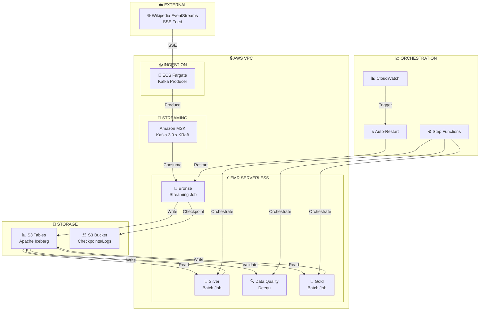

# WikiStream Pipeline Architecture

> Real-time Wikipedia Edit Stream Processing on AWS using Medallion Architecture

## 📊 Architecture Overview



## 🏗️ Component Details

### Data Ingestion Layer

| Component | Technology | Status | Description |
|-----------|------------|--------|-------------|
| **Data Source** | Wikipedia EventStreams | ✅ LIVE | Server-Sent Events (SSE) feed from `stream.wikimedia.org` |
| **Kafka Producer** | ECS Fargate (Python) | ✅ IMPLEMENTED | Consumes SSE, produces to MSK with IAM authentication |
| **Message Broker** | Amazon MSK (Kafka 3.9.x) | ✅ IMPLEMENTED | KRaft mode, 2 brokers, topics: `raw-events`, `dlq-events` |

### Processing Layer (EMR Serverless)

| Job | Type | Interval | Status | Description |
|-----|------|----------|--------|-------------|
| **Bronze** | Streaming | 30s micro-batches | ✅ IMPLEMENTED | Kafka → Iceberg with exactly-once semantics |
| **Silver** | Batch | Every 5 min | ✅ IMPLEMENTED | Deduplication, normalization, data cleansing |
| **Data Quality** | Batch | Every 5 min | ✅ IMPLEMENTED | Deequ validation: completeness, validity checks |
| **Gold** | Batch | Every 5 min | ✅ IMPLEMENTED | Aggregations: hourly stats, entity trends, risk scores |

### Storage Layer

| Component | Technology | Status | Description |
|-----------|------------|--------|-------------|
| **Tables** | S3 Tables (Apache Iceberg) | ✅ IMPLEMENTED | ACID transactions, time travel, schema evolution |
| **Namespaces** | bronze, silver, gold | ✅ IMPLEMENTED | Medallion architecture separation |
| **Artifacts** | S3 Bucket | ✅ IMPLEMENTED | Checkpoints, EMR logs, Spark job files |

### Orchestration & Monitoring

| Component | Technology | Status | Description |
|-----------|------------|--------|-------------|
| **Batch Pipeline** | Step Functions | ✅ IMPLEMENTED | Sequential: Silver → DQ → Gold |
| **Scheduler** | EventBridge | ✅ IMPLEMENTED | Triggers batch pipeline every 5 minutes |
| **Auto-Recovery** | Lambda | ✅ IMPLEMENTED | Restarts Bronze job on health check failure |
| **Monitoring** | CloudWatch | ✅ IMPLEMENTED | Dashboard, metrics, alarms, logs |
| **Alerts** | SNS | ✅ IMPLEMENTED | Pipeline failure notifications |

## 📐 Data Flow Diagram

```
┌─────────────────────────────────────────────────────────────────────────────────────────┐
│                              WikiStream Data Pipeline                                    │
└─────────────────────────────────────────────────────────────────────────────────────────┘

     INGESTION                    STREAMING                    PROCESSING
  ┌──────────────┐            ┌──────────────┐         ┌─────────────────────────┐
  │  Wikipedia   │            │   Amazon     │         │    EMR Serverless       │
  │ EventStreams │───SSE────▶│    MSK       │───────▶│                         │
  │    (SSE)     │            │  (Kafka)     │         │  ┌─────────────────┐   │
  └──────────────┘            └──────────────┘         │  │  Bronze Layer   │   │
         │                           │                 │  │  (Streaming)    │   │
         │                           │                 │  │  30s batches    │   │
         ▼                           ▼                 │  └────────┬────────┘   │
  ┌──────────────┐            ┌──────────────┐         │           │            │
  │ ECS Fargate  │            │ Topics:      │         │           ▼            │
  │   Producer   │───────────▶│ • raw-events │         │  ┌─────────────────┐   │
  │  (Python)    │            │ • dlq-events │         │  │  Silver Layer   │   │
  └──────────────┘            └──────────────┘         │  │  (Batch - 5min) │   │
                                                       │  └────────┬────────┘   │
                                                       │           │            │
                                                       │           ▼            │
                                                       │  ┌─────────────────┐   │
                                                       │  │  Data Quality   │   │
                                                       │  │  (Deequ)        │   │
                                                       │  └────────┬────────┘   │
                                                       │           │            │
                                                       │           ▼            │
                                                       │  ┌─────────────────┐   │
                                                       │  │   Gold Layer    │   │
                                                       │  │  (Aggregations) │   │
                                                       │  └─────────────────┘   │
                                                       └─────────────────────────┘
                                                                  │
                                                                  ▼
                                           ┌─────────────────────────────────────────┐
                                           │         S3 Tables (Apache Iceberg)      │
                                           │  ┌───────────┬───────────┬───────────┐  │
                                           │  │  bronze   │  silver   │   gold    │  │
                                           │  │  .wiki_   │  .wiki_   │  .hourly_ │  │
                                           │  │  events   │  events_  │  edit_    │  │
                                           │  │           │  cleaned  │  stats    │  │
                                           │  └───────────┴───────────┴───────────┘  │
                                           └─────────────────────────────────────────┘
```

## 🔧 Technology Stack

| Category | Technologies |
|----------|-------------|
| **Compute** | EMR Serverless (Spark 3.5), ECS Fargate, Lambda |
| **Streaming** | Amazon MSK (Kafka 3.9.x, KRaft mode) |
| **Table Format** | Apache Iceberg 1.10.0 via S3 Tables |
| **Data Quality** | AWS Deequ 2.0.7 |
| **Languages** | Python 3.12, PySpark, SQL |
| **Infrastructure** | Terraform 1.6+ |
| **Orchestration** | Step Functions, EventBridge |
| **Monitoring** | CloudWatch, SNS |

## ⚡ Key Features

### Streaming (Bronze Layer)
- **Exactly-once semantics** via Spark checkpointing
- **30-second micro-batches** for near real-time processing
- **Watermarking** for late/out-of-order events (5 min delay tolerance)
- **Dead Letter Queue** for malformed records
- **Idempotent MERGE** operations with deterministic event IDs

### Batch Processing (Silver/Gold Layers)
- **Sequential execution** via Step Functions (within vCPU quota)
- **5-minute SLA** for dashboard freshness
- **Data quality gates** before Gold layer updates

### Reliability
- **Auto-restart Lambda** monitors Bronze job health
- **CloudWatch alarms** trigger recovery on failures
- **SNS notifications** for pipeline alerts

## 📊 Tables Schema

### Bronze: `bronze.wiki_events`
Raw ingested events, partitioned by `event_date` and `event_hour`

### Silver: `silver.wiki_events_cleaned`  
Deduplicated and normalized events with standardized data types

### Gold Tables:
- `gold.hourly_edit_stats` - Hourly aggregated statistics
- `gold.entity_trends` - Entity-level trend analysis
- `gold.risk_scores` - Vandalism/anomaly risk scoring

## 🎯 SLA Targets

| Metric | Target | Current |
|--------|--------|---------|
| Bronze Ingestion Latency | ≤30 seconds | ✅ 30s |
| End-to-End Pipeline | ≤5 minutes | ✅ ~4 min |
| Data Quality Check | Every batch | ✅ Enabled |
| Auto-Recovery | <10 minutes | ✅ ~5 min |

---

*Architecture Document v1.0 - All components implemented and operational*

