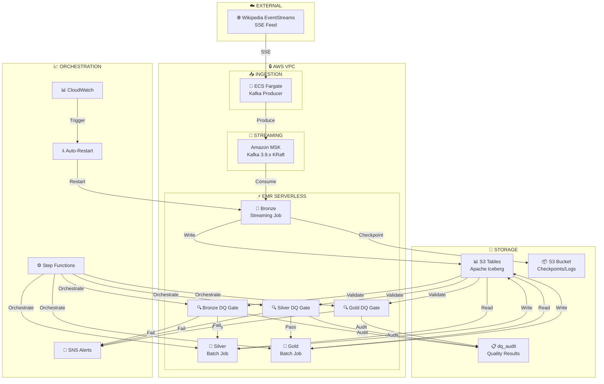

# WikiStream Pipeline Architecture

> Real-time Wikipedia Edit Stream Processing on AWS using Medallion Architecture with Data Quality Gates

## 📊 Architecture Overview



## 🏗️ Component Details

### Data Ingestion Layer

| Component | Technology | Status | Description |
|-----------|------------|--------|-------------|
| **Data Source** | Wikipedia EventStreams | ✅ LIVE | Server-Sent Events (SSE) feed from `stream.wikimedia.org` |
| **Kafka Producer** | ECS Fargate (Python) | ✅ IMPLEMENTED | Consumes SSE, produces to MSK with IAM authentication |
| **Message Broker** | Amazon MSK (Kafka 3.9.x) | ✅ IMPLEMENTED | KRaft mode, 2 brokers, topics: `raw-events`, `dlq-events` |

### Processing Layer (EMR Serverless)

| Job | Type | Interval | Status | Description |
|-----|------|----------|--------|-------------|
| **Bronze** | Streaming | 30s micro-batches | ✅ IMPLEMENTED | Kafka → Iceberg with exactly-once semantics |
| **Bronze DQ Gate** | Batch | On-demand | ✅ IMPLEMENTED | Completeness, timeliness (95% < 1min), validity checks |
| **Silver** | Batch | Every 5 min | ✅ IMPLEMENTED | Deduplication, normalization, data cleansing |
| **Silver DQ Gate** | Batch | Every 5 min | ✅ IMPLEMENTED | Accuracy, consistency, uniqueness, drift detection |
| **Gold** | Batch | Every 5 min | ✅ IMPLEMENTED | Aggregations: hourly stats, entity trends, risk scores |
| **Gold DQ Gate** | Batch | Every 5 min | ✅ IMPLEMENTED | Upstream verification, validation, consistency checks |

### Data Quality Gates (Deequ-based)

| Layer | Check Type | Threshold | Blocking |
|-------|------------|-----------|----------|
| **Bronze** | Completeness (critical fields) | 100% | ✅ Yes |
| **Bronze** | Completeness (important fields) | 95% | ⚠️ Warning |
| **Bronze** | Timeliness (event freshness) | 95% within 1min | ✅ Yes |
| **Bronze** | Validity (event_type, namespace) | 95% | ✅ Yes |
| **Bronze** | Uniqueness (event_id) | 100% | ✅ Yes |
| **Silver** | Accuracy (length_delta calculation) | 99% | ✅ Yes |
| **Silver** | Accuracy (is_anonymous derivation) | 99% | ✅ Yes |
| **Silver** | Accuracy (region mapping) | 100% | ✅ Yes |
| **Silver** | Consistency (is_valid flag) | 100% | ✅ Yes |
| **Silver** | Uniqueness (event_id) | 100% | ✅ Yes |
| **Silver** | Drift Detection | 20% change | ⚠️ Alert |
| **Gold** | Upstream Gates Passed | 100% | ✅ Yes |
| **Gold** | Consistency (events >= users) | 100% | ✅ Yes |
| **Gold** | Validity (bot_percentage 0-100) | 100% | ✅ Yes |
| **Gold** | Validity (risk_score 0-100) | 100% | ✅ Yes |

### Storage Layer

| Component | Technology | Status | Description |
|-----------|------------|--------|-------------|
| **Tables** | S3 Tables (Apache Iceberg) | ✅ IMPLEMENTED | ACID transactions, time travel, schema evolution |
| **Namespaces** | bronze, silver, gold, dq_audit | ✅ IMPLEMENTED | Medallion architecture + DQ audit trail |
| **Artifacts** | S3 Bucket | ✅ IMPLEMENTED | Checkpoints, EMR logs, Spark job files |

### Orchestration & Monitoring

| Component | Technology | Status | Description |
|-----------|------------|--------|-------------|
| **Batch Pipeline** | Step Functions | ✅ IMPLEMENTED | Sequential: Bronze DQ → Silver → Silver DQ → Gold → Gold DQ |
| **Scheduler** | EventBridge | ✅ IMPLEMENTED | Triggers batch pipeline every 5 minutes |
| **Auto-Recovery** | Lambda | ✅ IMPLEMENTED | Restarts Bronze job on health check failure |
| **Monitoring** | CloudWatch | ✅ IMPLEMENTED | Dashboard, DQ metrics, pipeline metrics, alarms |
| **Alerts** | SNS | ✅ IMPLEMENTED | DQ gate failures, pipeline failures, drift detection |
| **Local Monitoring** | Grafana (Docker) | ✅ IMPLEMENTED | Operational dashboard with CloudWatch integration |

## 📐 Data Flow Diagram

```
┌─────────────────────────────────────────────────────────────────────────────────────────┐
│                        WikiStream Data Pipeline with DQ Gates                            │
└─────────────────────────────────────────────────────────────────────────────────────────┘

     INGESTION                    STREAMING                    PROCESSING
  ┌──────────────┐            ┌──────────────┐         ┌─────────────────────────────────┐
  │  Wikipedia   │            │   Amazon     │         │       EMR Serverless            │
  │ EventStreams │───SSE────▶│    MSK       │───────▶│                                 │
  │    (SSE)     │            │  (Kafka)     │         │  ┌─────────────────┐            │
  └──────────────┘            └──────────────┘         │  │  Bronze Layer   │            │
         │                           │                 │  │  (Streaming)    │            │
         │                           │                 │  │  30s batches    │            │
         ▼                           ▼                 │  └────────┬────────┘            │
  ┌──────────────┐            ┌──────────────┐         │           │                     │
  │ ECS Fargate  │            │ Topics:      │         │           ▼                     │
  │   Producer   │───────────▶│ • raw-events │         │  ┌─────────────────┐            │
  │  (Python)    │            │ • dlq-events │         │  │  Bronze DQ Gate │◄───┐       │
  └──────────────┘            └──────────────┘         │  │  (Deequ Checks) │    │       │
                                                       │  └────────┬────────┘    │       │
                                                       │           │ Pass        │ Fail  │
                                                       │           ▼             │       │
                                                       │  ┌─────────────────┐    │       │
                                                       │  │  Silver Layer   │    ├───▶ SNS
                                                       │  │  (Batch - 5min) │    │       │
                                                       │  └────────┬────────┘    │       │
                                                       │           │             │       │
                                                       │           ▼             │       │
                                                       │  ┌─────────────────┐    │       │
                                                       │  │  Silver DQ Gate │◄───┤       │
                                                       │  │  (Drift Check)  │    │       │
                                                       │  └────────┬────────┘    │       │
                                                       │           │ Pass        │       │
                                                       │           ▼             │       │
                                                       │  ┌─────────────────┐    │       │
                                                       │  │   Gold Layer    │    │       │
                                                       │  │  (Aggregations) │    │       │
                                                       │  └────────┬────────┘    │       │
                                                       │           │             │       │
                                                       │           ▼             │       │
                                                       │  ┌─────────────────┐    │       │
                                                       │  │   Gold DQ Gate  │◄───┘       │
                                                       │  │  (Validation)   │            │
                                                       │  └─────────────────┘            │
                                                       └─────────────────────────────────┘
                                                                  │
                                                                  ▼
                                           ┌─────────────────────────────────────────────────┐
                                           │         S3 Tables (Apache Iceberg)              │
                                           │  ┌───────────┬───────────┬───────────┬────────┐│
                                           │  │  bronze   │  silver   │   gold    │dq_audit││
                                           │  │  .raw_    │  .cleaned_│  .hourly_ │.quality││
                                           │  │  events   │  events   │  stats    │_results││
                                           │  └───────────┴───────────┴───────────┴────────┘│
                                           └─────────────────────────────────────────────────┘
```

## 🔧 Technology Stack

| Category | Technologies |
|----------|-------------|
| **Compute** | EMR Serverless (Spark 3.5), ECS Fargate, Lambda |
| **Streaming** | Amazon MSK (Kafka 3.9.x, KRaft mode) |
| **Table Format** | Apache Iceberg 1.10.0 via S3 Tables |
| **Data Quality** | AWS Deequ 2.0.7 (Spark-native) |
| **Languages** | Python 3.12, PySpark, SQL |
| **Infrastructure** | Terraform 1.6+ |
| **Orchestration** | Step Functions, EventBridge |
| **Monitoring** | CloudWatch, Grafana, SNS |

## ⚡ Key Features

### Streaming (Bronze Layer)
- **Exactly-once semantics** via Spark checkpointing
- **30-second micro-batches** for near real-time processing
- **Watermarking** for late/out-of-order events (5 min delay tolerance)
- **Dead Letter Queue** for malformed records
- **Idempotent MERGE** operations with deterministic event IDs

### Data Quality Gates (All Layers)
- **Sequential pipeline execution** with blocking DQ gates
- **Completeness checks** on critical and important fields
- **Timeliness validation** (95th percentile within 1 minute)
- **Accuracy checks** for derived field calculations
- **Consistency validation** for business logic rules
- **Uniqueness enforcement** for primary key columns
- **Data drift detection** using 7-day baseline comparison
- **Audit trail** in `dq_audit.quality_results` table

### Batch Processing (Silver/Gold Layers)
- **Sequential execution** via Step Functions (within vCPU quota)
- **5-minute SLA** for dashboard freshness
- **DQ gates block** downstream processing on failure

### Reliability
- **Auto-restart Lambda** monitors Bronze job health
- **CloudWatch alarms** trigger recovery on failures
- **SNS notifications** for DQ gate failures and drift alerts

## 📊 Tables Schema

### Bronze: `bronze.raw_events`
Raw ingested events, partitioned by `event_date` and `event_hour`

### Silver: `silver.cleaned_events`  
Deduplicated and normalized events with standardized data types

### Gold Tables:
- `gold.hourly_stats` - Hourly aggregated statistics
- `gold.entity_trends` - Entity-level trend analysis
- `gold.risk_scores` - Vandalism/anomaly risk scoring

### DQ Audit: `dq_audit.quality_results`
- Check results, metrics, pass/fail status
- Evidence capture for failed checks
- Profile metrics for drift detection

## 🎯 SLA Targets

| Metric | Target | Current |
|--------|--------|---------|
| Bronze Ingestion Latency | ≤30 seconds | ✅ 30s |
| Event Timeliness | 95% < 1 minute | ✅ Validated |
| End-to-End Pipeline | ≤5 minutes | ✅ ~4 min |
| DQ Gate Execution | Every batch | ✅ Enabled |
| Auto-Recovery | <10 minutes | ✅ ~5 min |
| Drift Detection | 7-day baseline | ✅ Enabled |

## 🚀 Deployment

### Quick Start
```bash
# Create all infrastructure
./scripts/create_infra.sh

# Enable batch pipeline with DQ gates
aws events enable-rule --name wikistream-dev-batch-pipeline-schedule

# Start local Grafana monitoring
cd monitoring/docker && docker-compose up -d
```

### Teardown
```bash
# Partial destroy (preserves data)
./scripts/destroy_infra.sh

# Full destroy (removes everything)
./scripts/destroy_all.sh
```

---

*Architecture Document v2.0 - All components including DQ Gates implemented and operational*
