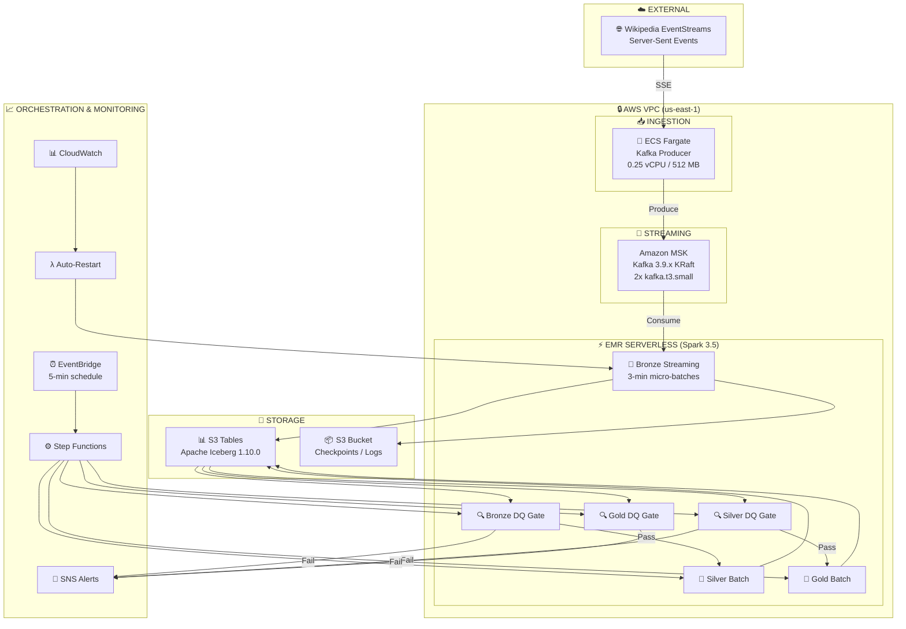

# WikiStream Pipeline Architecture

> Real-time Wikipedia Edit Stream Processing on AWS using Medallion Architecture with Data Quality Gates

## 📊 Architecture Overview



## 🏗️ Component Details

### Data Ingestion Layer

| Component | Technology | Configuration | Description |
|-----------|------------|---------------|-------------|
| **Data Source** | Wikipedia EventStreams | `stream.wikimedia.org` | Real-time SSE feed of Wikipedia edits |
| **Producer** | ECS Fargate (Python) | 0.25 vCPU, 512 MB | Consumes SSE, produces to Kafka with IAM auth |
| **Message Broker** | Amazon MSK (Kafka 3.9.x) | 2 brokers, KRaft mode | Topics: `raw-events`, `dlq-events` |

### Processing Layer (EMR Serverless)

| Job | Type | Trigger | Resource Allocation | Description |
|-----|------|---------|---------------------|-------------|
| **Bronze Streaming** | Spark Structured Streaming | 3-min micro-batches | 8 vCPU (2 driver + 2×2 executor) | Kafka → Iceberg with MERGE, 10-min watermark |
| **Bronze DQ Gate** | Batch | Step Functions | 4 vCPU (1 driver + 1×2 executor) | Completeness, timeliness, validity checks |
| **Silver Batch** | Batch | Step Functions (5 min) | 4 vCPU | Deduplication, normalization, region mapping |
| **Silver DQ Gate** | Batch | Step Functions | 4 vCPU | Accuracy, consistency, drift detection |
| **Gold Batch** | Batch | Step Functions (5 min) | 4 vCPU | Hourly stats, entity trends, risk scores |
| **Gold DQ Gate** | Batch | Step Functions | 4 vCPU | Upstream verification, validation checks |

### Data Quality Gates (AWS Deequ / PyDeequ)

DQ checks are implemented using **AWS Deequ** (via PyDeequ 1.4.0 wrapper) for scalable data quality validation. Deequ provides unit tests for data with automatic constraint verification. Results are logged to `dq_audit.quality_results`:

| Layer | Check Type | Description | Blocking |
|-------|------------|-------------|----------|
| **Bronze** | Completeness | Critical fields (event_id, event_type, domain, event_timestamp) 100% | ✅ Yes |
| **Bronze** | Completeness | Important fields (title, user, wiki) ≥95% | ⚠️ Warning |
| **Bronze** | Timeliness | 95th percentile event latency ≤60s | ✅ Yes |
| **Bronze** | Validity | event_type in allowed set, namespace ≥0, event_hour 0-23 | ✅ Yes |
| **Bronze** | Uniqueness | event_id unique within batch | ✅ Yes |
| **Silver** | Accuracy | length_delta = length_new - length_old (99%) | ✅ Yes |
| **Silver** | Accuracy | is_anonymous derived from IP pattern (99%) | ✅ Yes |
| **Silver** | Accuracy | Region mapping from domain (100%) | ✅ Yes |
| **Silver** | Consistency | is_valid flag = true for all Silver records | ✅ Yes |
| **Silver** | Drift | Null rate change >20% triggers alert | ⚠️ Alert |
| **Gold** | Upstream | Bronze & Silver gates must pass | ✅ Yes |
| **Gold** | Consistency | total_events ≥ unique_users | ✅ Yes |
| **Gold** | Validity | bot_percentage 0-100, risk_score 0-100 | ✅ Yes |

### Storage Layer (S3 Tables with Apache Iceberg)

| Namespace | Tables | Partitioning | Description |
|-----------|--------|--------------|-------------|
| **bronze** | `raw_events` | (event_date, event_hour) | Raw ingested events from Kafka |
| **silver** | `cleaned_events` | (event_date, region) | Deduplicated, normalized, enriched |
| **gold** | `hourly_stats` | (stat_date, region) | Hourly aggregated metrics by domain |
| **gold** | `risk_scores` | (stat_date) | User-level risk scoring with evidence |
| **dq_audit** | `quality_results` | (run_date, layer) | DQ check results for audit trail |
| **dq_audit** | `profile_metrics` | (run_date, layer) | Column statistics for drift detection |

**Iceberg Table Properties:**
- Format version 3 with merge-on-read
- ZSTD compression
- 512 MB compaction target
- 48-hour snapshot retention (dev mode)

### Orchestration Layer

| Component | Technology | Configuration | Description |
|-----------|------------|---------------|-------------|
| **Batch Pipeline** | Step Functions | `wikistream-dev-batch-pipeline` | Bronze DQ → Silver → Silver DQ → Gold → Gold DQ |
| **Scheduler** | EventBridge | Every 5 minutes (disabled by default) | Triggers batch pipeline |
| **Auto-Recovery** | Lambda | Triggered by CloudWatch alarm | Restarts Bronze job on health check failure |
| **Alerts** | SNS | Email subscription | DQ gate failures, pipeline failures |
| **Dashboard** | CloudWatch | `wikistream-dev-pipeline-dashboard` | Pipeline metrics, DQ status, alarms |

## 📐 Data Flow

```
┌─────────────────────────────────────────────────────────────────────────────────────────┐
│                         WikiStream Data Pipeline Flow                                    │
└─────────────────────────────────────────────────────────────────────────────────────────┘

     INGESTION                    STREAMING                         PROCESSING
  ┌──────────────┐            ┌──────────────┐         ┌─────────────────────────────────────┐
  │  Wikipedia   │            │   Amazon     │         │         EMR Serverless (Spark 3.5)  │
  │ EventStreams │───SSE────▶│    MSK       │───────▶│                                     │
  │   (Live)     │            │  (Kafka)     │         │  ┌─────────────────┐                │
  └──────────────┘            └──────────────┘         │  │  Bronze Layer   │                │
         │                           │                 │  │  (Streaming)    │                │
         ▼                           ▼                 │  │  3-min batches  │                │
  ┌──────────────┐            ┌──────────────┐         │  └────────┬────────┘                │
  │ ECS Fargate  │            │ Topics:      │         │           │                         │
  │   Producer   │───────────▶│ • raw-events │         │           ▼                         │
  │  (Python)    │            │ • dlq-events │         │  ┌─────────────────┐                │
  └──────────────┘            └──────────────┘         │  │  Bronze DQ Gate │◄───┐           │
                                                       │  │  (PySpark)      │    │           │
                                                       │  └────────┬────────┘    │           │
                                                       │           │ Pass        │ Fail      │
                                                       │           ▼             │           │
                                                       │  ┌─────────────────┐    ├───▶ SNS   │
                                                       │  │  Silver Layer   │    │           │
                                                       │  │  (Batch - 5min) │    │           │
                                                       │  └────────┬────────┘    │           │
                                                       │           │             │           │
                                                       │           ▼             │           │
                                                       │  ┌─────────────────┐    │           │
                                                       │  │  Silver DQ Gate │◄───┤           │
                                                       │  │  (Drift Check)  │    │           │
                                                       │  └────────┬────────┘    │           │
                                                       │           │ Pass        │           │
                                                       │           ▼             │           │
                                                       │  ┌─────────────────┐    │           │
                                                       │  │   Gold Layer    │    │           │
                                                       │  │  (Aggregations) │    │           │
                                                       │  └────────┬────────┘    │           │
                                                       │           │             │           │
                                                       │           ▼             │           │
                                                       │  ┌─────────────────┐    │           │
                                                       │  │   Gold DQ Gate  │◄───┘           │
                                                       │  │  (Validation)   │                │
                                                       │  └─────────────────┘                │
                                                       └─────────────────────────────────────┘
                                                                      │
                                                                      ▼
                                               ┌─────────────────────────────────────────────────┐
                                               │           S3 Tables (Apache Iceberg 1.10.0)     │
                                               │  ┌──────────┬──────────┬──────────┬───────────┐ │
                                               │  │  bronze  │  silver  │   gold   │  dq_audit │ │
                                               │  │ .raw_    │.cleaned_ │.hourly_  │ .quality_ │ │
                                               │  │ events   │ events   │ stats    │  results  │ │
                                               │  │          │          │.risk_    │ .profile_ │ │
                                               │  │          │          │ scores   │  metrics  │ │
                                               │  └──────────┴──────────┴──────────┴───────────┘ │
                                               └─────────────────────────────────────────────────┘
```

## 🔧 Technology Stack

| Category | Technologies |
|----------|--------------|
| **Compute** | EMR Serverless (Spark 3.5, emr-7.12.0), ECS Fargate, Lambda |
| **Streaming** | Amazon MSK (Kafka 3.9.x, KRaft mode, IAM auth) |
| **Table Format** | Apache Iceberg 1.10.0 via S3 Tables |
| **Data Quality** | AWS Deequ 2.0.7 + PyDeequ 1.4.0 with audit logging |
| **Languages** | Python 3.12, PySpark, SQL |
| **Infrastructure** | Terraform 1.6+, AWS Provider 5.80+ |
| **Orchestration** | AWS Step Functions, EventBridge |
| **Monitoring** | CloudWatch (Dashboard + Alarms), SNS, Grafana (local) |

## ⚡ Key Implementation Details

### Bronze Layer (Streaming)
- **Trigger Interval**: 3 minutes (reduced from 30s to minimize Iceberg snapshots)
- **Watermark Delay**: 10 minutes for late event handling
- **Deduplication**: Deterministic `event_id` with `MERGE INTO` for idempotent upserts
- **Schema Version**: Tracked for evolution support

### Silver Layer (Batch)
- **Region Mapping**: Domain → region (asia_pacific, europe, americas, middle_east, other)
- **Anonymity Detection**: IP address pattern matching
- **Quality Flags**: `is_valid`, `is_large_deletion`, `is_large_addition`
- **Processing**: Only valid events pass to Silver

### Gold Layer (Batch)
- **Hourly Stats**: Volume, content, user, and edit type metrics by domain/region
- **Risk Scores**: User-level scoring (0-100) based on edit velocity, large deletions, cross-domain activity
- **Risk Levels**: LOW/MEDIUM/HIGH with evidence JSON for alerting

### DQ Gate Pipeline Flow
```
EventBridge (5 min) → Step Functions:
  1. Bronze DQ Gate (validates recent Bronze data)
     ↓ Pass
  2. Silver Batch Job (transforms Bronze → Silver)
     ↓ 
  3. Silver DQ Gate (validates Silver, checks drift)
     ↓ Pass
  4. Gold Batch Job (aggregates Silver → Gold)
     ↓
  5. Gold DQ Gate (validates upstream + Gold)
     ↓ Pass
  ✅ Success
  
  Any failure → SNS Alert → Pipeline Fails
```

## 🎯 SLA Targets

| Metric | Target | Implementation |
|--------|--------|----------------|
| Bronze Ingestion | ≤3 minutes | Spark Streaming trigger interval |
| Event Freshness | 95% <1 minute | Timeliness check in Bronze DQ |
| End-to-End | ≤5 minutes | Sequential Step Functions pipeline |
| DQ Gate Execution | Every 5 minutes | EventBridge schedule |
| Auto-Recovery | <10 minutes | Lambda restarts Bronze on failure |

## 🚀 Deployment

### Quick Start
```bash
# Create all infrastructure (~25-35 minutes for MSK)
./scripts/create_infra.sh

# Enable batch pipeline with DQ gates
aws events enable-rule --name wikistream-dev-batch-pipeline-schedule

# Start local Grafana monitoring
cd monitoring/docker && docker-compose up -d
# Open http://localhost:3000 (admin/wikistream)
```

### Teardown
```bash
# Partial destroy (preserves data)
./scripts/destroy_infra.sh

# Full destroy (removes everything)
./scripts/destroy_all.sh
```

## 📁 Project Structure

```
wikistream/
├── producer/                    # ECS Fargate Kafka producer
│   ├── Dockerfile
│   ├── kafka_producer.py
│   └── requirements.txt
├── spark/
│   ├── jobs/
│   │   ├── bronze_streaming_job.py   # Kafka → Bronze Iceberg
│   │   ├── silver_batch_job.py       # Bronze → Silver
│   │   ├── gold_batch_job.py         # Silver → Gold
│   │   ├── bronze_dq_gate.py         # Bronze DQ checks
│   │   ├── silver_dq_gate.py         # Silver DQ checks
│   │   ├── gold_dq_gate.py           # Gold DQ checks
│   │   └── dq/                       # DQ module (packaged as dq.zip)
│   │       ├── __init__.py
│   │       ├── dq_checks.py          # Check implementations
│   │       └── dq_utils.py           # Audit, metrics, alerts
│   └── schemas/
├── infrastructure/terraform/    # IaC (VPC, MSK, EMR, S3 Tables, Step Functions)
├── monitoring/
│   ├── docker/                  # Local Grafana setup
│   └── grafana/dashboards/
├── scripts/
│   ├── create_infra.sh          # Full deployment
│   ├── destroy_infra.sh         # Partial teardown
│   └── destroy_all.sh           # Full teardown
└── docs/
    ├── ARCHITECTURE.md          # This file
    └── architecture_diagram.html
```

---

*Architecture Document v2.1 - Accurate representation of implemented system*
