# WikiStream Operations Runbook

> **Complete operational guide** for maintaining, modifying, troubleshooting, and managing the WikiStream real-time data pipeline.

---

## Table of Contents

1. [Quick Reference (Command Cheat Sheet)](#1-quick-reference-command-cheat-sheet)
2. [Pipeline Overview & Architecture](#2-pipeline-overview--architecture)
3. [Environment Setup & Prerequisites](#3-environment-setup--prerequisites)
4. [Day-to-Day Operations](#4-day-to-day-operations)
5. [Modifying Spark Jobs](#5-modifying-spark-jobs)
6. [Modifying Infrastructure](#6-modifying-infrastructure)
7. [Modifying Producer Configuration](#7-modifying-producer-configuration)
8. [Modifying Data Quality (DQ) Checks](#8-modifying-data-quality-dq-checks)
9. [Troubleshooting Guide](#9-troubleshooting-guide)
10. [Permissions & Access Control](#10-permissions--access-control)
11. [Service Quotas & Limits](#11-service-quotas--limits)
12. [Monitoring & Alerting](#12-monitoring--alerting)
13. [Code Deep Dive & Implementation Details](#13-code-deep-dive--implementation-details)
14. [Disaster Recovery & Backups](#14-disaster-recovery--backups)
15. [Cost Optimization](#15-cost-optimization)

---

## 1. Quick Reference (Command Cheat Sheet)

### 1.1 Essential Variables (Export These First)

```bash
# Always set these before running any commands
export AWS_PROFILE="neuefische"
export AWS_REGION="us-east-1"

# Navigate to project root
cd /Users/shihab/Documents/Neue_Fische/wikistream

# Get resource IDs from Terraform (run from terraform directory)
cd infrastructure/terraform
export AWS_ACCOUNT_ID=$(aws sts get-caller-identity --query Account --output text)
export EMR_APP_ID=$(terraform output -raw emr_serverless_app_id)
export DATA_BUCKET=$(terraform output -raw data_bucket)
export S3_TABLES_ARN=$(terraform output -raw s3_tables_bucket_arn)
export MSK_BOOTSTRAP=$(terraform output -raw msk_bootstrap_brokers_iam)
export ECS_CLUSTER=$(terraform output -raw ecs_cluster_name)
export ECR_REPO=$(terraform output -raw ecr_repository_url)
export SNS_TOPIC=$(terraform output -raw alerts_sns_topic_arn)
export EMR_ROLE_ARN=$(terraform output -raw emr_serverless_role_arn)
cd ../..
```

### 1.2 Infrastructure Lifecycle

| Action | Command |
|--------|---------|
| **Full Create (dev)** | `./scripts/create_infra.sh` |
| **Full Create (staging)** | `./scripts/create_infra.sh staging` |
| **Full Create (prod)** | `./scripts/create_infra.sh prod` |
| **Full Destroy (dev)** | `./scripts/destroy_all.sh` |
| **Full Destroy (staging)** | `./scripts/destroy_all.sh staging` |
| **Apply Terraform Changes** | `cd infrastructure/terraform && terraform apply -var-file=environments/dev.tfvars` |
| **View Terraform State** | `terraform show` |
| **Plan Changes** | `terraform plan -var-file=environments/dev.tfvars -out=tfplan` |

### 1.3 ECS Producer Commands

| Action | Command |
|--------|---------|
| **Start Producer** | `aws ecs update-service --cluster $ECS_CLUSTER --service ${NAME_PREFIX}-producer --desired-count 1` |
| **Stop Producer** | `aws ecs update-service --cluster $ECS_CLUSTER --service ${NAME_PREFIX}-producer --desired-count 0` |
| **View Logs** | `aws logs tail /ecs/${NAME_PREFIX}-producer --follow --since 5m` |
| **Force New Deployment** | `aws ecs update-service --cluster $ECS_CLUSTER --service ${NAME_PREFIX}-producer --force-new-deployment` |
| **Check Task Status** | `aws ecs list-tasks --cluster $ECS_CLUSTER --service ${NAME_PREFIX}-producer` |

> **Note:** Replace `${NAME_PREFIX}` with your environment prefix (e.g., `wikistream-dev`, `wikistream-staging`)

### 1.4 EMR Serverless Commands

| Action | Command |
|--------|---------|
| **List All Jobs** | `aws emr-serverless list-job-runs --application-id $EMR_APP_ID` |
| **View Running Jobs** | `aws emr-serverless list-job-runs --application-id $EMR_APP_ID --states RUNNING` |
| **Get Job Details** | `aws emr-serverless get-job-run --application-id $EMR_APP_ID --job-run-id <JOB_ID>` |
| **Cancel Job** | `aws emr-serverless cancel-job-run --application-id $EMR_APP_ID --job-run-id <JOB_ID>` |
| **Start EMR App** | `aws emr-serverless start-application --application-id $EMR_APP_ID` |
| **Stop EMR App** | `aws emr-serverless stop-application --application-id $EMR_APP_ID` |
| **View App State** | `aws emr-serverless get-application --application-id $EMR_APP_ID --query 'application.state'` |
| **Verify Resource Usage** | `./scripts/verify_emr_resources.sh` |

### 1.5 Step Functions Commands

| Action | Command |
|--------|---------|
| **List Executions** | `aws stepfunctions list-executions --state-machine-arn arn:aws:states:us-east-1:$AWS_ACCOUNT_ID:stateMachine:${NAME_PREFIX}-batch-pipeline --max-results 5` |
| **Start Batch Pipeline** | `aws stepfunctions start-execution --state-machine-arn arn:aws:states:us-east-1:$AWS_ACCOUNT_ID:stateMachine:${NAME_PREFIX}-batch-pipeline --input '{}'` |
| **Stop Execution** | `aws stepfunctions stop-execution --execution-arn <EXECUTION_ARN> --cause "Manual stop"` |
| **Get Execution Status** | `aws stepfunctions describe-execution --execution-arn <EXECUTION_ARN>` |

### 1.6 Kafka/MSK Commands

| Action | Command |
|--------|---------|
| **List Topics** | See script in Section 9.5 |
| **Describe Consumer Groups** | See script in Section 9.5 |
| **Check MSK Cluster** | `aws kafka describe-cluster --cluster-arn $(aws kafka list-clusters --query 'ClusterInfoList[0].ClusterArn' --output text)` |

### 1.7 S3 Tables Commands

| Action | Command |
|--------|---------|
| **List Namespaces** | `aws s3tables list-namespaces --table-bucket-arn $S3_TABLES_ARN` |
| **List Tables** | `aws s3tables list-tables --table-bucket-arn $S3_TABLES_ARN --namespace bronze` |
| **Get Table Info** | `aws s3tables get-table --table-bucket-arn $S3_TABLES_ARN --namespace bronze --name raw_events` |

### 1.8 Upload Spark Jobs After Changes

```bash
# After modifying any Spark job
cd /Users/shihab/Documents/Neue_Fische/wikistream

# Upload job files (excluding DQ module)
aws s3 cp spark/jobs/ s3://$DATA_BUCKET/spark/jobs/ --recursive \
    --exclude "__pycache__/*" --exclude "*.pyc" --exclude "dq/*"

# Repackage and upload DQ module
cd spark/jobs
rm -rf dq_package dq.zip 2>/dev/null || true
mkdir -p dq_package
pip install pydeequ==1.4.0 --target dq_package --quiet --no-deps 2>/dev/null || true
cp -r dq dq_package/
cd dq_package && zip -rq ../dq.zip . -x "*/__pycache__/*" && cd ..
aws s3 cp dq.zip s3://$DATA_BUCKET/spark/jobs/dq.zip
rm -rf dq_package dq.zip
cd ../..
```

---

## 2. Pipeline Overview & Architecture

### 2.1 High-Level Architecture

```mermaid
flowchart TB
    subgraph EXT["☁️ EXTERNAL"]
        WIKI["🌐 Wikipedia EventStreams<br/>Server-Sent Events"]
    end

    subgraph VPC["🔒 AWS VPC (us-east-1)"]
        subgraph INGEST["📥 INGESTION"]
            ECS["🐳 ECS Fargate<br/>Kafka Producer<br/>0.25 vCPU / 512 MB"]
        end

        subgraph STREAM["📡 STREAMING"]
            MSK["Amazon MSK<br/>Kafka 3.9.x KRaft<br/>2x kafka.t3.small"]
        end

        subgraph PROCESS["⚡ EMR SERVERLESS (Spark 3.5)"]
            BRONZE["🥉 Bronze Streaming<br/>3-min micro-batches"]
            BRONZE_DQ["🔍 Bronze DQ Gate"]
            SILVER["🥈 Silver Batch"]
            SILVER_DQ["🔍 Silver DQ Gate"]
            GOLD["🥇 Gold Batch"]
            GOLD_DQ["🔍 Gold DQ Gate"]
        end
    end

    subgraph STORE["💾 STORAGE"]
        S3T["📊 S3 Tables<br/>Apache Iceberg 1.10.0"]
        S3["📦 S3 Bucket<br/>Checkpoints / Logs"]
    end

    subgraph OPS["📈 ORCHESTRATION & MONITORING"]
        SFN["⚙️ Step Functions"]
        EB["⏰ EventBridge<br/>15-min schedule"]
        CW["📊 CloudWatch"]
        LAMBDA["λ Auto-Restart"]
        SNS["📧 SNS Alerts"]
    end

    WIKI -->|SSE| ECS
    ECS -->|Produce| MSK
    MSK -->|Consume| BRONZE
    BRONZE --> S3T
    BRONZE --> S3
    S3T --> BRONZE_DQ
    BRONZE_DQ -->|Pass| SILVER
    SILVER --> S3T
    S3T --> SILVER_DQ
    SILVER_DQ -->|Pass| GOLD
    GOLD --> S3T
    S3T --> GOLD_DQ
    EB --> SFN
    SFN --> BRONZE_DQ
    SFN --> SILVER
    SFN --> SILVER_DQ
    SFN --> GOLD
    SFN --> GOLD_DQ
    CW --> LAMBDA
    LAMBDA --> BRONZE
    BRONZE_DQ -->|Fail| SNS
    SILVER_DQ -->|Fail| SNS
    GOLD_DQ -->|Fail| SNS
```



### 2.2 Component Summary

| Component | Technology | Purpose |
|-----------|------------|---------|
| **Producer** | ECS Fargate (Python) | Consumes Wikipedia SSE → Kafka |
| **Message Broker** | Amazon MSK (Kafka 3.9.x KRaft) | Event queue with 2 brokers |
| **Bronze Processing** | EMR Serverless (Spark Streaming) | Raw ingestion, 3-min micro-batches |
| **Silver Processing** | EMR Serverless (Spark Batch) | Cleaning, enrichment, deduplication |
| **Gold Processing** | EMR Serverless (Spark Batch) | Aggregations, risk scores |
| **DQ Gates** | EMR Serverless + PyDeequ | Data quality validation |
| **Storage** | S3 Tables (Apache Iceberg) | Medallion architecture tables |
| **Orchestration** | Step Functions (self-looping) | Batch pipeline orchestration |
| **Auto-Recovery** | Lambda + CloudWatch | Restarts Bronze on failure |
| **Monitoring** | CloudWatch Dashboard + Alarms | Pipeline health monitoring |
| **Alerting** | SNS | Email alerts on failures |

### 2.3 Data Flow Pipeline

```
Wikipedia SSE (500-700 edits/min)
       │
       ▼
┌──────────────────────────────────────────────────────────────┐
│ ECS Producer (kafka_producer.py)                              │
│ • Filters 18 target domains                                   │
│ • Validates events                                            │
│ • Enriches with processing metadata                           │
│ • Produces to raw-events topic (invalid → dlq-events)        │
└──────────────────────────────────────────────────────────────┘
       │
       ▼
┌──────────────────────────────────────────────────────────────┐
│ MSK Kafka (raw-events topic)                                  │
│ • 6 partitions, replication factor 2                          │
│ • IAM authentication                                          │
│ • 7-day retention                                             │
└──────────────────────────────────────────────────────────────┘
       │
       ▼
┌──────────────────────────────────────────────────────────────┐
│ Bronze Streaming Job (bronze_streaming_job.py)                │
│ • Spark Structured Streaming                                  │
│ • 3-minute trigger interval                                   │
│ • 10-minute watermark for late events                        │
│ • MERGE INTO for idempotent writes                           │
│ • CloudWatch metrics publishing                               │
│ OUTPUT: s3tablesbucket.bronze.raw_events                     │
└──────────────────────────────────────────────────────────────┘
       │
       ▼
┌──────────────────────────────────────────────────────────────┐
│ Step Functions (wikistream-dev-batch-pipeline)                │
│ Self-looping: runs every ~25-35 min (10 min wait between)    │
│                                                               │
│  1. Bronze DQ Gate → validates Bronze data                    │
│     ├─ PASS → continue                                        │
│     └─ FAIL → SNS alert, stop pipeline                       │
│                                                               │
│  2. Silver Batch Job → transforms Bronze → Silver             │
│     ├─ SUCCESS → continue                                     │
│     └─ FAIL → SNS alert, stop pipeline                       │
│                                                               │
│  3. Silver DQ Gate → validates Silver data                    │
│     ├─ PASS → continue                                        │
│     └─ FAIL → SNS alert, stop pipeline                       │
│                                                               │
│  4. Gold Batch Job → aggregates Silver → Gold                 │
│     ├─ SUCCESS → continue                                     │
│     └─ FAIL → SNS alert, stop pipeline                       │
│                                                               │
│  5. Gold DQ Gate → validates Gold data                        │
│     ├─ PASS → Wait 10 min → Self-trigger next cycle          │
│     └─ FAIL → SNS alert, stop pipeline                       │
└──────────────────────────────────────────────────────────────┘
```

### 2.4 Resource Allocation Strategy

**EMR Serverless vCPU Quota: 16 vCPU (default)**

| Job | Driver | Executor | Total vCPU | When |
|-----|--------|----------|------------|------|
| Bronze Streaming | 1×2 vCPU | 1×2 vCPU | 4 vCPU | Continuous |
| Batch Jobs (each) | 1×1 vCPU | 1×2 vCPU | 3-4 vCPU | Sequential |
| **Max Concurrent** | - | - | **8 vCPU** | Bronze + 1 batch |

---

## 3. Environment Setup & Prerequisites

### 3.1 Required Tools

```bash
# Check versions
aws --version          # AWS CLI v2.x required
terraform --version    # Terraform >= 1.6.0
docker --version       # Docker for building images
python --version       # Python 3.12 recommended
```

### 3.2 AWS Profile Setup

```bash
# Configure AWS CLI profile
aws configure --profile neuefische
# Enter:
#   AWS Access Key ID
#   AWS Secret Access Key
#   Default region: us-east-1
#   Default output: json

# Verify access
aws sts get-caller-identity --profile neuefische
```

### 3.3 First-Time Setup

```bash
# 1. Setup Terraform backend (S3 + DynamoDB for state locking)
./scripts/setup_terraform_backend.sh

# 2. Initialize Terraform
cd infrastructure/terraform
terraform init

# 3. Create terraform.tfvars (if customizing)
cat > terraform.tfvars << EOF
project_name = "wikistream"
environment = "dev"
aws_region = "us-east-1"
alert_email = "your-email@example.com"
EOF

# 4. Deploy infrastructure
terraform apply

# 5. Full pipeline startup (handles everything)
cd ../..
./scripts/create_infra.sh
```

---

## 4. Day-to-Day Operations

### 4.1 Starting the Pipeline (After Destroy or Fresh Install)

```bash
# Full start - handles everything automatically
./scripts/create_infra.sh
```

**What `create_infra.sh` does:**
1. Stops any running EMR jobs (required for Terraform updates)
2. Runs `terraform apply`
3. Configures S3 Tables storage class
4. Builds and pushes Docker image (if not exists)
5. Uploads Spark jobs to S3
6. Starts ECS producer service
7. Starts EMR application
8. Submits Bronze streaming job
9. Schedules batch pipeline via EventBridge Scheduler (15 min delay)

### 4.2 Stopping the Pipeline (End of Day / Cost Saving)

```bash
# Full destroy - removes everything
./scripts/destroy_all.sh
```

**What `destroy_all.sh` does (13 steps):**
1. Disables EventBridge rules/schedules
2. Stops Step Functions executions
3. Cancels all EMR jobs (waits for cancellation)
4. Stops EMR application (waits for STOPPED state)
5. Stops ECS services
6. Runs `terraform destroy`
7. Deletes S3 Tables (async, takes 5-10 min)
8. Empties and deletes S3 data bucket
9. Deletes ECR repository
10. Deletes CloudWatch resources
11. Cleans up remaining resources (fallback)
12. Cleans local Terraform state
13. Final verification

### 4.3 Checking Pipeline Health

```bash
# 1. Check ECS producer
aws ecs describe-services --cluster $ECS_CLUSTER --services wikistream-dev-producer \
    --query 'services[0].{status:status,running:runningCount,desired:desiredCount}'

# 2. Check Bronze streaming job
aws emr-serverless list-job-runs --application-id $EMR_APP_ID --states RUNNING \
    --query 'jobRuns[?name==`bronze-streaming`].{id:id,state:state,createdAt:createdAt}'

# 3. Check Step Functions status
aws stepfunctions list-executions \
    --state-machine-arn arn:aws:states:us-east-1:$AWS_ACCOUNT_ID:stateMachine:wikistream-dev-batch-pipeline \
    --max-results 3 --query 'executions[*].{name:name,status:status,startDate:startDate}'

# 4. Check CloudWatch alarms
aws cloudwatch describe-alarms --alarm-name-prefix wikistream \
    --query 'MetricAlarms[*].{name:AlarmName,state:StateValue}'

# 5. Check recent logs
aws logs tail /ecs/wikistream-dev-producer --since 5m
aws logs tail /aws/emr-serverless/wikistream-dev --since 5m
```

### 4.4 Viewing Data in Tables

```bash
# Query Bronze table (using Athena)
aws athena start-query-execution \
    --query-string "SELECT COUNT(*) as cnt, event_date FROM s3tablesbucket.bronze.raw_events GROUP BY event_date ORDER BY event_date DESC LIMIT 5" \
    --work-group primary \
    --result-configuration OutputLocation=s3://$DATA_BUCKET/athena-results/

# Or use the AWS Console:
# 1. Go to S3 Tables Console
# 2. Select wikistream-dev-tables bucket
# 3. Browse namespaces: bronze, silver, gold, dq_audit
```

### 4.5 Manual Job Execution

```bash
# Manually start batch pipeline (if not auto-triggered)
aws stepfunctions start-execution \
    --state-machine-arn arn:aws:states:us-east-1:$AWS_ACCOUNT_ID:stateMachine:wikistream-dev-batch-pipeline \
    --input '{"triggered_by": "manual"}'

# Manually run individual jobs
# Silver only:
aws stepfunctions start-execution \
    --state-machine-arn arn:aws:states:us-east-1:$AWS_ACCOUNT_ID:stateMachine:wikistream-dev-silver-processing

# Gold only:
aws stepfunctions start-execution \
    --state-machine-arn arn:aws:states:us-east-1:$AWS_ACCOUNT_ID:stateMachine:wikistream-dev-gold-processing
```

---

## 5. Modifying Spark Jobs

### 5.1 Modifying Bronze Streaming Job

**File:** `spark/jobs/bronze_streaming_job.py`

**Common modifications:**

#### 5.1.1 Change Trigger Interval

```python
# Line 47 in bronze_streaming_job.py
TRIGGER_INTERVAL = "3 minutes"  # Change to desired interval

# Options:
# - "30 seconds" - More frequent but more Iceberg snapshots
# - "3 minutes" - Balanced (current)
# - "5 minutes" - Less frequent, fewer snapshots
```

**After modification:**
```bash
# Upload updated job
aws s3 cp spark/jobs/bronze_streaming_job.py s3://$DATA_BUCKET/spark/jobs/

# Restart Bronze job
aws emr-serverless cancel-job-run --application-id $EMR_APP_ID --job-run-id <CURRENT_JOB_ID>
# Wait for cancellation, then Lambda auto-restarts OR restart manually
```

#### 5.1.2 Change Watermark Delay

```python
# Line 48 in bronze_streaming_job.py
WATERMARK_DELAY = "10 minutes"  # Allow late events up to N minutes

# Increase for high-latency networks, decrease for lower tolerance
```

#### 5.1.3 Add New Fields to Bronze Schema

```python
# Add to BRONZE_SCHEMA (line 67-94)
StructField("new_field_name", StringType(), True),

# Add extraction in transform_to_bronze() function
get_json_object(col("data_json"), "$.path.to.field").alias("new_field_name"),

# Add to CREATE TABLE statement (line 323-366)
new_field_name STRING,

# Add to final select (line 216-224)
"new_field_name",
```

**After schema changes:**
```bash
# Upload job
aws s3 cp spark/jobs/bronze_streaming_job.py s3://$DATA_BUCKET/spark/jobs/

# Iceberg handles schema evolution automatically with ALTER TABLE
# Restart Bronze job for changes to take effect
```

### 5.2 Modifying Silver Batch Job

**File:** `spark/jobs/silver_batch_job.py`

#### 5.2.1 Add New Region Mapping

```python
# Add to DOMAIN_REGION_MAP (line 28-51)
DOMAIN_REGION_MAP = {
    # ... existing mappings ...
    "new.wikipedia.org": ("region_name", "lang_code"),
}
```

#### 5.2.2 Modify Quality Flags

```python
# In add_quality_flags() function (line 115-132)
# Change thresholds:
.withColumn("is_large_deletion",
    when(col("length_delta").isNotNull() & (col("length_delta") < -5000), True)  # Change -5000
    .otherwise(False))
.withColumn("is_large_addition",
    when(col("length_delta").isNotNull() & (col("length_delta") > 50000), True)  # Change 50000
    .otherwise(False))
```

#### 5.2.3 Change Lookback Window

```python
# In main() function (line 196-199)
# Default is 1 hour, change for backfill:
lookback_hours = 1  # Change default
# Or pass as argument when submitting job
```

### 5.3 Modifying Gold Batch Job

**File:** `spark/jobs/gold_batch_job.py`

#### 5.3.1 Modify Risk Score Thresholds

```python
# Line 33-38
RISK_THRESHOLDS = {
    "edits_per_hour": 50,      # High if user makes >50 edits/hour
    "large_deletions": 3,      # High if >3 large deletions
    "bot_edit_ratio": 0.8,     # Flag if domain >80% bot edits
    "anonymous_ratio": 0.5,    # Flag if user >50% anonymous edits
}
```

#### 5.3.2 Add New Aggregation Metric

```python
# In compute_hourly_stats() function (line 68-121)
# Add to SELECT statement:
SUM(CASE WHEN namespace = 0 THEN 1 ELSE 0 END) AS main_namespace_edits,

# Add column to CREATE TABLE (line 445-481)
main_namespace_edits BIGINT,

# Add to MERGE statement (line 600-630)
target.main_namespace_edits = source.main_namespace_edits,
```

### 5.4 Deployment Workflow for Spark Job Changes

```bash
# 1. Make changes to job file

# 2. Test locally (optional - requires Spark setup)
# spark-submit --master local[2] spark/jobs/silver_batch_job.py 1

# 3. Upload to S3
aws s3 cp spark/jobs/<job_file>.py s3://$DATA_BUCKET/spark/jobs/

# 4. If DQ module changed, repackage
cd spark/jobs
rm -rf dq_package dq.zip
mkdir -p dq_package
pip install pydeequ==1.4.0 --target dq_package --quiet --no-deps
cp -r dq dq_package/
cd dq_package && zip -rq ../dq.zip . -x "*/__pycache__/*" && cd ..
aws s3 cp dq.zip s3://$DATA_BUCKET/spark/jobs/dq.zip
rm -rf dq_package dq.zip
cd ../..

# 5. For Bronze: restart the streaming job
# Find current job
BRONZE_JOB=$(aws emr-serverless list-job-runs --application-id $EMR_APP_ID \
    --states RUNNING --query 'jobRuns[?name==`bronze-streaming`].id' --output text)
# Cancel it
aws emr-serverless cancel-job-run --application-id $EMR_APP_ID --job-run-id $BRONZE_JOB
# Lambda will auto-restart, or start manually

# 6. For batch jobs: they'll pick up changes on next scheduled run
# Or trigger manually:
aws stepfunctions start-execution \
    --state-machine-arn arn:aws:states:us-east-1:$AWS_ACCOUNT_ID:stateMachine:wikistream-dev-batch-pipeline
```

---

## 6. Modifying Infrastructure

### 6.0 Terraform Module Structure (NEW)

The Terraform codebase is now organized into reusable modules:

```
infrastructure/terraform/
├── main.tf                    # Root module - orchestrates all modules
├── variables.tf               # All configurable parameters
├── outputs.tf                 # Outputs for scripts
├── versions.tf                # Terraform version constraints
├── backend.tf                 # S3 backend configuration
├── providers.tf               # AWS provider configuration
├── locals.tf                  # Local values
├── data.tf                    # Data sources
├── environments/              # Environment-specific tfvars
│   ├── dev.tfvars
│   ├── staging.tfvars
│   └── prod.tfvars
└── modules/
    ├── networking/            # VPC, subnets, security groups
    ├── storage/               # S3, S3 Tables
    ├── streaming/             # MSK Kafka
    ├── compute/               # ECS, EMR Serverless, ECR, Lambda
    ├── orchestration/         # Step Functions, EventBridge
    │   └── templates/         # JSON templates for Step Functions
    └── monitoring/            # CloudWatch, SNS, alarms
```

### 6.1 Changing Environment Configuration

**For environment-specific changes, modify the appropriate tfvars file:**

| Environment | File | When to Use |
|-------------|------|-------------|
| Development | `environments/dev.tfvars` | Local testing, portfolio demo |
| Staging | `environments/staging.tfvars` | Pre-production testing |
| Production | `environments/prod.tfvars` | Live workloads |

**Example - Increase EMR capacity for staging:**
```hcl
# environments/staging.tfvars
emr_max_vcpu             = "32 vCPU"
emr_max_memory           = "128 GB"
emr_prewarm_driver_count = 2
```

**Apply changes:**
```bash
cd infrastructure/terraform
terraform plan -var-file=environments/staging.tfvars   # Review changes
terraform apply -var-file=environments/staging.tfvars  # Apply changes
```

### 6.2 Multi-Environment Workflow

**Deploy different environments:**
```bash
# Development (default)
./scripts/create_infra.sh

# Staging
./scripts/create_infra.sh staging

# Production (requires confirmation)
./scripts/create_infra.sh prod
```

**Destroy environments:**
```bash
./scripts/destroy_all.sh          # Destroy dev
./scripts/destroy_all.sh staging  # Destroy staging
./scripts/destroy_all.sh prod     # Destroy prod (requires "DELETE PROD")
```

**Key differences between environments:**

| Parameter | Dev | Staging | Prod |
|-----------|-----|---------|------|
| MSK Instance | kafka.t3.small | kafka.t3.small | kafka.m5.large |
| MSK Brokers | 2 | 2 | 3 |
| EMR Max vCPU | 16 | 32 | 64 |
| Log Retention | 7 days | 14 days | 30 days |
| Snapshot Retention | 48 hours | 7 days | 30 days |
| NAT Gateways | 1 (single) | 1 (single) | 3 (per AZ) |

### 6.3 Changing EMR Serverless Configuration

### 6.4 Changing EMR Serverless Configuration

**File:** `infrastructure/terraform/modules/compute/main.tf`

#### 6.2.1 Increase Maximum Capacity (Requires Quota Increase)

```hcl
# Line 770-774
maximum_capacity {
  cpu    = "16 vCPU"  # Increase if you have higher quota (e.g., "32 vCPU")
  memory = "64 GB"    # 4 GB per vCPU ratio
  disk   = "200 GB"   # For shuffle and temp data
}
```

#### 6.2.2 Change Auto-Stop Timeout

```hcl
# Line 780-783
auto_stop_configuration {
  enabled              = true
  idle_timeout_minutes = 15  # Increase to keep warm longer (reduces cold starts)
}
```

#### 6.2.3 Change Pre-Warm Capacity

```hcl
# Lines 791-814 - Initial capacity for faster job starts
initial_capacity {
  initial_capacity_type = "DRIVER"
  initial_capacity_config {
    worker_count = 1  # Increase for more pre-warmed drivers
    worker_configuration {
      cpu    = "2 vCPU"
      memory = "4 GB"
      disk   = "20 GB"
    }
  }
}

initial_capacity {
  initial_capacity_type = "EXECUTOR"
  initial_capacity_config {
    worker_count = 1  # Increase for more pre-warmed executors
    # ...
  }
}
```

### 6.3 Changing MSK Configuration

**File:** `infrastructure/terraform/main.tf` (lines 318-376)

#### 6.3.1 Change Kafka Properties

```hcl
# Lines 322-331
resource "aws_msk_configuration" "wikistream" {
  server_properties = <<-PROPERTIES
    auto.create.topics.enable=true
    default.replication.factor=2
    min.insync.replicas=1
    num.partitions=6                # Increase for higher parallelism
    log.retention.hours=168         # Change retention (7 days default)
    log.retention.bytes=-1          # -1 = unlimited
    compression.type=snappy
  PROPERTIES
}
```

#### 6.3.2 Change Broker Instance Type

```hcl
# Lines 338-339
resource "aws_msk_cluster" "wikistream" {
  broker_node_group_info {
    instance_type   = "kafka.t3.small"  # Options: kafka.m5.large, kafka.m5.xlarge
    # ...
  }
}
```

> **Warning:** Changing MSK configuration may require cluster recreation (~25-35 min).

### 6.4 Changing S3 Tables Maintenance Settings

**File:** `infrastructure/terraform/main.tf` (lines 221-258)

```hcl
maintenance_configuration = {
  # Compaction: Merges small files
  iceberg_compaction = {
    settings = {
      target_file_size_mb = 512  # Target file size (256-1024 MB typical)
    }
    status = "enabled"
  }

  # Snapshot retention
  iceberg_snapshot_management = {
    settings = {
      min_snapshots_to_keep  = 1   # Minimum 1 for recovery
      max_snapshot_age_hours = 48  # 2 days for dev, 168 (7 days) for prod
    }
    status = "enabled"
  }

  # Orphan file cleanup
  iceberg_unreferenced_file_removal = {
    settings = {
      unreferenced_days = 3  # Days before cleanup (3-7 typical)
      non_current_days  = 1  # Days for old versions
    }
    status = "enabled"
  }
}
```

### 6.5 Changing Step Functions Job Timeouts

**File:** `infrastructure/terraform/main.tf` (Step Functions definition, ~line 977)

```hcl
# In each job state, find TimeoutSeconds:
"BronzeDQGate": {
  "TimeoutSeconds": 900,  # 15 minutes - increase for larger data volumes
  # ...
}
```

### 6.6 Applying Infrastructure Changes

```bash
cd infrastructure/terraform

# Preview changes
terraform plan -out=tfplan

# Apply changes
terraform apply tfplan

# If you see errors about running EMR jobs, stop them first:
aws emr-serverless stop-application --application-id $EMR_APP_ID
# Wait for STOPPED state, then apply again
```

---

## 7. Modifying Producer Configuration

### 7.1 Adding New Target Domains

**File:** `producer/kafka_producer.py` (lines 46-70)

```python
TARGET_DOMAINS = {
    # High activity
    "en.wikipedia.org",
    # ... existing domains ...
    
    # Add new domain:
    "sv.wikipedia.org",  # Swedish Wikipedia
}
```

**After modification:**
```bash
# 1. Rebuild Docker image
cd producer
aws ecr get-login-password --region us-east-1 | \
    docker login --username AWS --password-stdin $AWS_ACCOUNT_ID.dkr.ecr.us-east-1.amazonaws.com
docker build --platform linux/amd64 -t $ECR_REPO:latest .
docker push $ECR_REPO:latest

# 2. Force ECS to pull new image
aws ecs update-service --cluster $ECS_CLUSTER \
    --service wikistream-dev-producer --force-new-deployment
```

### 7.2 Changing Kafka Producer Settings

**File:** `producer/kafka_producer.py` (lines 114-137)

```python
def create_kafka_producer(bootstrap_servers: str) -> Producer:
    config = {
        # ...
        'acks': 'all',                  # 'all', '1', '0' - durability vs speed
        'retries': 3,                   # Number of retries
        'retry.backoff.ms': 1000,       # Backoff between retries
        'compression.type': 'snappy',   # 'snappy', 'gzip', 'lz4', 'zstd'
        'linger.ms': 50,                # Batching delay
        'batch.size': 32768,            # Batch size in bytes
        'max.in.flight.requests.per.connection': 5,
        # ...
    }
    return Producer(config)
```

### 7.3 Changing Event Validation Rules

**File:** `producer/kafka_producer.py` (lines 145-172)

```python
def validate_event(event_data: dict) -> tuple[bool, Optional[str]]:
    required_fields = ["meta", "type"]  # Add/remove required fields
    
    for field in required_fields:
        if field not in event_data:
            return False, f"Missing required field: {field}"
    
    # Add custom validation:
    if event_data.get("type") == "forbidden_type":
        return False, "Forbidden event type"
    
    return True, None
```

### 7.4 Changing Event Enrichment

**File:** `producer/kafka_producer.py` (lines 192-212)

```python
def enrich_event(event_data: dict) -> dict:
    enriched = {
        "id": event_data.get("meta", {}).get("id"),
        "data": json.dumps(event_data),
        "_processing": {
            "ingested_at": datetime.utcnow().isoformat() + "Z",
            "producer_version": "1.0.0",  # Update version
            "environment": ENVIRONMENT,
            # Add custom metadata:
            "source_domain": event_data.get("meta", {}).get("domain"),
        }
    }
    return enriched
```

---

## 8. Modifying Data Quality (DQ) Checks

### 8.1 DQ Module Structure

```
spark/jobs/dq/
├── __init__.py           # Package init
├── dq_checks.py          # PyDeequ check implementations
└── dq_utils.py           # Audit writer, metrics, alerts
```

### 8.2 Modifying Bronze DQ Checks

**File:** `spark/jobs/dq/dq_checks.py` (BronzeDQChecks class, line 583)

#### 8.2.1 Change Critical/Important Fields

```python
class BronzeDQChecks(BaseDQChecks):
    CRITICAL_FIELDS = ["event_id", "event_type", "domain", "event_timestamp"]  # 100% required
    IMPORTANT_FIELDS = ["title", "user", "wiki"]  # 95% threshold
```

#### 8.2.2 Change Allowed Event Types

```python
ALLOWED_EVENT_TYPES = ["edit", "new", "log", "categorize", "external", "unknown"]
# Add new types as needed
```

#### 8.2.3 Change Timeliness Threshold

```python
TIMELINESS_THRESHOLD_SECONDS = 180  # 3 minutes - adjust based on SLA
```

### 8.3 Modifying Silver DQ Checks

**File:** `spark/jobs/dq/dq_checks.py` (SilverDQChecks class, line 753)

```python
class SilverDQChecks(BaseDQChecks):
    ALLOWED_REGIONS = ["asia_pacific", "europe", "americas", "middle_east", "other"]
    
    # Domain to region mapping for accuracy validation
    DOMAIN_REGION_MAP = {
        "zh.wikipedia.org": "asia_pacific",
        # Add new mappings...
    }
    
    # IP pattern for anonymity detection
    IP_PATTERN = r"^\d{1,3}\.\d{1,3}\.\d{1,3}\.\d{1,3}$"
```

### 8.4 Adding New DQ Checks

**Example: Add a uniqueness check for Silver**

```python
# In SilverDQChecks.run_all_checks():
if PYDEEQU_AVAILABLE:
    check = Check(self.spark, CheckLevel.Error, "Silver DQ Checks")
    # Existing checks...
    check = check.isUnique("event_id")  # Add this line
```

### 8.5 Changing DQ Gate Behavior

**Make a check WARNING instead of FAIL:**

```python
# Change CheckLevel.Error to CheckLevel.Warning for specific checks
check = Check(self.spark, CheckLevel.Warning, "Non-blocking checks")
```

### 8.6 Deployment After DQ Changes

```bash
# Must repackage DQ module
cd spark/jobs
rm -rf dq_package dq.zip
mkdir -p dq_package
pip install pydeequ==1.4.0 --target dq_package --quiet --no-deps
cp -r dq dq_package/
cd dq_package && zip -rq ../dq.zip . -x "*/__pycache__/*" && cd ..
aws s3 cp dq.zip s3://$DATA_BUCKET/spark/jobs/dq.zip
rm -rf dq_package dq.zip
cd ../..

# Upload individual DQ gate files
aws s3 cp spark/jobs/bronze_dq_gate.py s3://$DATA_BUCKET/spark/jobs/
aws s3 cp spark/jobs/silver_dq_gate.py s3://$DATA_BUCKET/spark/jobs/
aws s3 cp spark/jobs/gold_dq_gate.py s3://$DATA_BUCKET/spark/jobs/
```

---

## 9. Troubleshooting Guide

### 9.1 Bronze Streaming Job Not Running

**Symptoms:**
- No new data in bronze.raw_events
- CloudWatch alarm triggered
- No running Bronze job in EMR console

**Diagnosis:**
```bash
# Check if job exists
aws emr-serverless list-job-runs --application-id $EMR_APP_ID --states RUNNING \
    --query 'jobRuns[?name==`bronze-streaming`]'

# Check recent failed jobs
aws emr-serverless list-job-runs --application-id $EMR_APP_ID --states FAILED \
    --max-results 5 --query 'jobRuns[*].{id:id,name:name,state:state}'

# Get failure reason
aws emr-serverless get-job-run --application-id $EMR_APP_ID --job-run-id <FAILED_JOB_ID> \
    --query 'jobRun.stateDetails'

# Check logs
aws logs tail /aws/emr-serverless/wikistream-dev --since 30m --filter-pattern "ERROR"
```

**Common causes and solutions:**

| Cause | Solution |
|-------|----------|
| MSK not ready | Wait for MSK ACTIVE state, restart job |
| IAM permission error | Check EMR role has MSK permissions |
| Checkpoint corruption | Delete checkpoint: `aws s3 rm s3://$DATA_BUCKET/checkpoints/bronze --recursive` |
| OOM error | Increase executor memory in Lambda/Step Functions config |
| Network timeout | Check VPC security groups allow MSK ports 9092-9098 |

**Manual restart:**
```bash
# Start Bronze job manually
aws emr-serverless start-job-run \
    --application-id $EMR_APP_ID \
    --execution-role-arn $EMR_ROLE_ARN \
    --name "bronze-streaming" \
    --job-driver '{
        "sparkSubmit": {
            "entryPoint": "s3://'"$DATA_BUCKET"'/spark/jobs/bronze_streaming_job.py",
            "entryPointArguments": ["'"$MSK_BOOTSTRAP"'", "'"$DATA_BUCKET"'"],
            "sparkSubmitParameters": "--conf spark.driver.cores=1 --conf spark.driver.memory=2g --conf spark.executor.cores=2 --conf spark.executor.memory=4g --conf spark.executor.instances=1 --conf spark.dynamicAllocation.enabled=false --conf spark.jars.packages=org.apache.iceberg:iceberg-spark-runtime-3.5_2.12:1.10.0,software.amazon.s3tables:s3-tables-catalog-for-iceberg-runtime:0.1.8,software.amazon.awssdk:bundle:2.29.0,org.apache.spark:spark-sql-kafka-0-10_2.12:3.5.0,software.amazon.msk:aws-msk-iam-auth:2.2.0 --conf spark.sql.extensions=org.apache.iceberg.spark.extensions.IcebergSparkSessionExtensions --conf spark.sql.catalog.s3tablesbucket=org.apache.iceberg.spark.SparkCatalog --conf spark.sql.catalog.s3tablesbucket.catalog-impl=software.amazon.s3tables.iceberg.S3TablesCatalog --conf spark.sql.catalog.s3tablesbucket.warehouse='"$S3_TABLES_ARN"' --conf spark.sql.catalog.s3tablesbucket.client.region=us-east-1"
        }
    }' \
    --configuration-overrides '{
        "monitoringConfiguration": {
            "cloudWatchLoggingConfiguration": {
                "enabled": true,
                "logGroupName": "/aws/emr-serverless/wikistream-dev",
                "logStreamNamePrefix": "bronze"
            }
        }
    }'
```

### 9.2 DQ Gate Failures

**Symptoms:**
- Step Functions execution failed
- SNS alert received
- Pipeline stopped

**Diagnosis:**
```bash
# Find failed execution
aws stepfunctions list-executions \
    --state-machine-arn arn:aws:states:us-east-1:$AWS_ACCOUNT_ID:stateMachine:wikistream-dev-batch-pipeline \
    --status-filter FAILED --max-results 1

# Get execution history
aws stepfunctions get-execution-history \
    --execution-arn <EXECUTION_ARN> \
    --query 'events[?type==`TaskFailed`].taskFailedEventDetails'

# Check DQ audit table (via Athena or console)
# Query: SELECT * FROM s3tablesbucket.dq_audit.quality_results 
#        WHERE status = 'FAILED' ORDER BY run_timestamp DESC LIMIT 10
```

**Common DQ failures:**

| Check | Cause | Solution |
|-------|-------|----------|
| completeness_event_id | Malformed events | Check producer validation |
| timeliness | High latency | May be expected after restart; check threshold |
| uniqueness_event_id | Duplicates | Check Kafka for replays |
| accuracy_length_delta | Calculation error | Check Silver job logic |
| region_mapping | Unknown domain | Add to DOMAIN_REGION_MAP |

**Fix and restart:**
```bash
# After fixing the root cause, restart pipeline
aws stepfunctions start-execution \
    --state-machine-arn arn:aws:states:us-east-1:$AWS_ACCOUNT_ID:stateMachine:wikistream-dev-batch-pipeline \
    --input '{"triggered_by": "manual_restart_after_fix"}'
```

### 9.3 Step Functions Stuck or Not Running

**Symptoms:**
- No recent executions
- Pipeline not processing
- Data getting stale

**Diagnosis:**
```bash
# Check for running executions
aws stepfunctions list-executions \
    --state-machine-arn arn:aws:states:us-east-1:$AWS_ACCOUNT_ID:stateMachine:wikistream-dev-batch-pipeline \
    --status-filter RUNNING

# Check EventBridge schedule (if using fixed schedule)
aws events describe-rule --name wikistream-dev-batch-pipeline-schedule

# Check for EventBridge Scheduler schedules
aws scheduler list-schedules --name-prefix wikistream
```

**Solutions:**

```bash
# If no executions running, start manually:
aws stepfunctions start-execution \
    --state-machine-arn arn:aws:states:us-east-1:$AWS_ACCOUNT_ID:stateMachine:wikistream-dev-batch-pipeline

# If execution stuck, stop it:
aws stepfunctions stop-execution \
    --execution-arn <STUCK_EXECUTION_ARN> \
    --cause "Manually stopped due to stuck state"
# Then start new execution
```

### 9.4 ECS Producer Not Producing

**Symptoms:**
- Kafka topic not receiving messages
- Producer logs show errors
- ECS task keeps restarting

**Diagnosis:**
```bash
# Check task status
aws ecs describe-tasks --cluster $ECS_CLUSTER \
    --tasks $(aws ecs list-tasks --cluster $ECS_CLUSTER --service wikistream-dev-producer \
              --query 'taskArns[0]' --output text)

# Check logs
aws logs tail /ecs/wikistream-dev-producer --since 10m

# Check task definition
aws ecs describe-task-definition --task-definition wikistream-dev-producer
```

**Common issues:**

| Error | Cause | Solution |
|-------|-------|----------|
| `Connection refused` | MSK not ready | Wait for MSK ACTIVE |
| `Authentication failed` | IAM issue | Check ECS task role |
| `No such topic` | Topic not created | MSK auto-creates, wait or check MSK config |
| `SSE connection error` | Wikipedia rate limit | Add User-Agent header (already done) |

**Force restart:**
```bash
aws ecs update-service --cluster $ECS_CLUSTER \
    --service wikistream-dev-producer \
    --force-new-deployment
```

### 9.5 MSK/Kafka Issues

**Check MSK cluster status:**
```bash
# Get cluster ARN
MSK_ARN=$(aws kafka list-clusters --query 'ClusterInfoList[0].ClusterArn' --output text)

# Check status
aws kafka describe-cluster --cluster-arn $MSK_ARN \
    --query 'ClusterInfo.{State:State,CurrentVersion:CurrentVersion}'

# Check broker endpoints
aws kafka get-bootstrap-brokers --cluster-arn $MSK_ARN
```

**Test Kafka connectivity (requires kafkacat or similar):**
```bash
# Install kcat (formerly kafkacat)
# brew install kcat  # macOS

# List topics (requires proper auth setup)
# This is complex with IAM auth - easier to check via MSK console
```

### 9.6 S3 Tables Issues

**List tables and check status:**
```bash
# List namespaces
aws s3tables list-namespaces --table-bucket-arn $S3_TABLES_ARN

# List tables in namespace
aws s3tables list-tables --table-bucket-arn $S3_TABLES_ARN --namespace bronze

# Get table details
aws s3tables get-table --table-bucket-arn $S3_TABLES_ARN --namespace bronze --name raw_events
```

**If table is corrupted:**
```bash
# Option 1: Compact table (via Spark SQL)
# CALL s3tablesbucket.system.rewrite_data_files('bronze.raw_events')

# Option 2: Delete and recreate (loses data)
aws s3tables delete-table --table-bucket-arn $S3_TABLES_ARN --namespace bronze --name raw_events
# Job will recreate on next run
```

### 9.7 Out of Memory (OOM) Errors

**Symptoms:**
- Job fails with OOM
- `java.lang.OutOfMemoryError`
- Task killed by YARN

**Diagnosis:**
```bash
# Check job logs for OOM
aws logs tail /aws/emr-serverless/wikistream-dev --filter-pattern "OutOfMemoryError"

# Get job resource usage
aws emr-serverless get-job-run --application-id $EMR_APP_ID --job-run-id <JOB_ID> \
    --query 'jobRun.{totalResourceUtilization:totalResourceUtilization}'
```

**Solutions:**

1. **Increase executor memory** (in Terraform main.tf, Step Functions definition):
```
--conf spark.executor.memory=8g  # Increase from 4g
```

2. **Increase driver memory**:
```
--conf spark.driver.memory=4g    # Increase from 2g
```

3. **Add more executors**:
```
--conf spark.executor.instances=2  # Increase from 1
```

4. **Reduce data window** (in job arguments):
```bash
# Process less data per run
# Silver/Gold: change lookback_hours from 1 to 0.5
```

### 9.8 Cold Start Delays

**Symptoms:**
- Jobs take 5-8 minutes before processing starts
- High latency in pipeline

**Solutions:**

1. **Increase pre-warmed capacity** (Terraform main.tf):
```hcl
initial_capacity {
  initial_capacity_config {
    worker_count = 2  # Increase from 1
  }
}
```

2. **Increase idle timeout**:
```hcl
auto_stop_configuration {
  idle_timeout_minutes = 30  # Increase from 15
}
```

3. **Reduce JAR download time** by using S3 for dependencies instead of Maven.

### 9.9 Viewing and Analyzing Logs

```bash
# EMR Serverless logs (CloudWatch)
aws logs tail /aws/emr-serverless/wikistream-dev --follow

# EMR Serverless logs (S3)
aws s3 ls s3://$DATA_BUCKET/emr-serverless/logs/ --recursive | head -20

# Download specific log
aws s3 cp s3://$DATA_BUCKET/emr-serverless/logs/bronze/<job-id>/spark-driver-stdout.log.gz .
gunzip spark-driver-stdout.log.gz
less spark-driver-stdout.log

# ECS Producer logs
aws logs tail /ecs/wikistream-dev-producer --follow

# Lambda logs (auto-restart)
aws logs tail /aws/lambda/wikistream-dev-bronze-restart --since 1h

# MSK logs
aws logs tail /aws/msk/wikistream-dev --since 30m
```

---

## 10. Permissions & Access Control

### 10.1 IAM Roles Overview

| Role | Service | Purpose |
|------|---------|---------|
| `wikistream-dev-emr-serverless-role` | EMR Serverless | Spark jobs access to S3, MSK, S3 Tables |
| `wikistream-dev-ecs-task-role` | ECS Tasks | Producer access to MSK |
| `wikistream-dev-ecs-execution-role` | ECS | Pull images, write logs |
| `wikistream-dev-sfn-role` | Step Functions | Start EMR jobs, publish SNS |
| `wikistream-dev-eventbridge-sfn-role` | EventBridge | Trigger Step Functions |
| `wikistream-dev-bronze-restart-lambda-role` | Lambda | Restart EMR jobs |

### 10.2 Granting S3 Tables Access to an IAM User

```bash
# Create policy for read-only S3 Tables access
cat > s3tables-read-policy.json << 'EOF'
{
    "Version": "2012-10-17",
    "Statement": [
        {
            "Sid": "S3TablesRead",
            "Effect": "Allow",
            "Action": [
                "s3tables:GetTable",
                "s3tables:ListTables",
                "s3tables:GetTableBucket",
                "s3tables:ListTableBuckets",
                "s3tables:ListNamespaces",
                "s3tables:GetNamespace"
            ],
            "Resource": [
                "arn:aws:s3tables:us-east-1:*:bucket/wikistream-*",
                "arn:aws:s3tables:us-east-1:*:bucket/wikistream-*/*"
            ]
        },
        {
            "Sid": "S3TablesDataRead",
            "Effect": "Allow",
            "Action": [
                "s3:GetObject",
                "s3:ListBucket"
            ],
            "Resource": [
                "arn:aws:s3:::s3tables-*",
                "arn:aws:s3:::s3tables-*/*"
            ]
        }
    ]
}
EOF

# Create policy
aws iam create-policy \
    --policy-name wikistream-s3tables-read \
    --policy-document file://s3tables-read-policy.json

# Attach to user
aws iam attach-user-policy \
    --user-name <USERNAME> \
    --policy-arn arn:aws:iam::$AWS_ACCOUNT_ID:policy/wikistream-s3tables-read

# Cleanup
rm s3tables-read-policy.json
```

### 10.3 Granting Write Access to Specific Tables

```bash
# For write access to specific table (e.g., analysts can write to gold only)
cat > s3tables-gold-write-policy.json << 'EOF'
{
    "Version": "2012-10-17",
    "Statement": [
        {
            "Sid": "GoldTableWrite",
            "Effect": "Allow",
            "Action": [
                "s3tables:*"
            ],
            "Resource": [
                "arn:aws:s3tables:us-east-1:*:bucket/wikistream-dev-tables/table/gold/*"
            ]
        }
    ]
}
EOF

aws iam create-policy \
    --policy-name wikistream-gold-write \
    --policy-document file://s3tables-gold-write-policy.json
```

### 10.4 Modifying EMR Serverless Role Permissions

**File:** `infrastructure/terraform/main.tf` (lines 469-633)

```hcl
resource "aws_iam_role_policy" "emr_serverless" {
  # Add new permissions here
  policy = jsonencode({
    Statement = [
      # ... existing statements ...
      {
        Sid    = "NewServiceAccess"
        Effect = "Allow"
        Action = ["new-service:*"]
        Resource = "*"
      }
    ]
  })
}
```

After changes:
```bash
terraform apply
```

### 10.5 Cross-Account Access

For accessing data from another AWS account:

```bash
# In the source account (where data lives), add bucket policy:
{
    "Version": "2012-10-17",
    "Statement": [
        {
            "Sid": "CrossAccountAccess",
            "Effect": "Allow",
            "Principal": {
                "AWS": "arn:aws:iam::<TARGET_ACCOUNT_ID>:role/wikistream-dev-emr-serverless-role"
            },
            "Action": [
                "s3tables:GetTable",
                "s3tables:ListTables"
            ],
            "Resource": "arn:aws:s3tables:us-east-1:<SOURCE_ACCOUNT_ID>:bucket/*"
        }
    ]
}
```

---

## 11. Service Quotas & Limits

### 11.1 Current EMR Serverless Quota

```bash
# Check current quota
aws service-quotas get-service-quota \
    --service-code emr-serverless \
    --quota-code L-D05C8A75 \
    --query 'Quota.Value'

# List all EMR Serverless quotas
aws service-quotas list-service-quotas \
    --service-code emr-serverless \
    --query 'Quotas[*].{Name:QuotaName,Value:Value}'
```

### 11.2 Requesting Quota Increase

```bash
# Request vCPU quota increase
aws service-quotas request-service-quota-increase \
    --service-code emr-serverless \
    --quota-code L-D05C8A75 \
    --desired-value 32

# Check request status
aws service-quotas list-requested-service-quota-change-history-by-quota \
    --service-code emr-serverless \
    --quota-code L-D05C8A75
```

**Or via Console:**
1. Go to Service Quotas Console
2. Search for "EMR Serverless"
3. Find "Max concurrent vCPUs per account"
4. Click "Request quota increase"
5. Enter desired value (e.g., 32)

### 11.3 Important Quotas to Monitor

| Service | Quota | Default | Impact |
|---------|-------|---------|--------|
| EMR Serverless | Max concurrent vCPUs | 16 | Limits parallel jobs |
| MSK | Max brokers per cluster | 15 | Scaling limit |
| S3 | Request rate per prefix | 3,500 PUT/s | High volume writes |
| Step Functions | Concurrent executions | 1,000 | Pipeline parallelism |
| Lambda | Concurrent executions | 1,000 | Auto-restart scaling |

### 11.4 Other Useful Quota Commands

```bash
# List all quotas for a service
aws service-quotas list-service-quotas --service-code <SERVICE_CODE>

# Service codes:
# - emr-serverless
# - kafka (MSK)
# - s3
# - states (Step Functions)
# - lambda
# - ecs
```

### 11.5 EMR Resource Management & Optimization

#### 11.5.1 Understanding Resource Allocation

With a 16 vCPU quota, resource allocation strategy is critical:

```
┌─────────────────────────────────────────────────────────┐
│ Component              │ vCPU  │ State                  │
├─────────────────────────────────────────────────────────┤
│ Pre-warming           │  4    │ Always allocated       │
│ Bronze Streaming      │  3    │ Always running         │
│ Batch Job (1 at time) │  5    │ Sequential execution   │
├─────────────────────────────────────────────────────────┤
│ Peak Usage            │ 12    │ Bronze + Batch         │
│ Available Buffer      │  4    │ Safety margin          │
└─────────────────────────────────────────────────────────┘
```

**Key Insight**: Batch jobs are **sequential** (not concurrent):
- Only 1 batch job runs at a time
- Bronze DQ → waits → Silver → waits → Silver DQ → etc.
- Maximum: 3 (bronze) + 4 (pre-warm) + 5 (1 batch job) = **12 vCPU**

#### 11.5.2 Verify Current Resource Usage

```bash
# Run the resource verification script
./scripts/verify_emr_resources.sh

# Expected output:
# ✅ Pre-warming: 4 vCPU
# ✅ Bronze streaming: 3 vCPU
# ✅ Available capacity: 4+ vCPU
# ✅ No capacity errors
```

**Manual verification:**

```bash
# Check pre-warming configuration
aws emr-serverless get-application \
    --application-id $EMR_APP_ID \
    --query 'application.initialCapacity' \
    --output json

# Check maximum capacity
aws emr-serverless get-application \
    --application-id $EMR_APP_ID \
    --query 'application.maximumCapacity'

# List running jobs
aws emr-serverless list-job-runs \
    --application-id $EMR_APP_ID \
    --states RUNNING PENDING SUBMITTED

# Check for recent capacity errors
aws logs filter-log-events \
    --log-group-name /aws/emr-serverless/wikistream-dev \
    --filter-pattern "ApplicationMaxCapacityExceededException" \
    --start-time $(($(date +%s) - 3600))000
```

#### 11.5.3 Common Resource Issues & Solutions

**Problem: `ApplicationMaxCapacityExceededException`**

Error: `Worker could not be allocated as the application has exceeded maximumCapacity settings: [cpu: 16 vCPU]`

**Diagnosis:**
```bash
# Calculate current usage
# Pre-warming: Check initialCapacity
# Running jobs: List job-runs with RUNNING state
# Total must be ≤ 16 vCPU
```

**Solution Options:**

**Option A: Reduce Pre-warming** (Recommended for 16 vCPU quota)

File: `infrastructure/terraform/environments/dev.tfvars`
```hcl
# Minimal pre-warming (4 vCPU total)
emr_prewarm_driver_count   = 1  # 2 vCPU
emr_prewarm_executor_count = 1  # 2 vCPU

# More capacity available
# Result: 4 pre-warm + 3 bronze + 5 batch = 12 vCPU (4 vCPU buffer)
```

**Option B: Remove Pre-warming Entirely** (Slower startup)
```hcl
# No pre-warming (cold start: +10-15 seconds)
emr_prewarm_driver_count   = 0
emr_prewarm_executor_count = 0

# Maximum capacity available
# Result: 3 bronze + 5 batch = 8 vCPU (8 vCPU buffer)
```

**Option C: Reduce Batch Job Resources** (Slower processing)

File: `infrastructure/terraform/modules/orchestration/main.tf`
```hcl
# Use only 1 executor per batch job
base_spark_params = "--conf spark.executor.instances=1 ..."

# Each batch job: 3 vCPU (1 driver + 1 executor)
# Result: 4 pre-warm + 3 bronze + 3 batch = 10 vCPU (6 vCPU buffer)
```

**Apply changes:**
```bash
cd infrastructure/terraform
terraform apply -var-file=environments/dev.tfvars

# Verify changes
../scripts/verify_emr_resources.sh
```

#### 11.5.4 Optimized Configuration for 16 vCPU Quota

**Current Optimized Settings** (infrastructure/terraform/environments/dev.tfvars):

```hcl
# EMR Serverless Configuration
emr_max_vcpu               = "16 vCPU"    # Total quota
emr_max_memory             = "64 GB"       # 4 GB per vCPU
emr_max_disk               = "200 GB"      # Storage
emr_idle_timeout_minutes   = 15            # Auto-stop
emr_prewarm_driver_count   = 1             # 2 vCPU (fast startup)
emr_prewarm_executor_count = 1             # 2 vCPU (ready capacity)
```

**Batch Job Configuration** (infrastructure/terraform/modules/orchestration/main.tf):

```hcl
# Each batch job: 5 vCPU (1 driver + 2 executors)
base_spark_params = "--conf spark.driver.cores=1 \
  --conf spark.driver.memory=2g \
  --conf spark.executor.cores=2 \
  --conf spark.executor.memory=4g \
  --conf spark.executor.instances=2 \
  --conf spark.dynamicAllocation.enabled=false"
```

**Bronze Streaming Configuration** (scripts/create_infra.sh):

```bash
# Bronze streaming: 3 vCPU (1 driver + 1 executor)
spark.driver.cores=1
spark.driver.memory=2g
spark.executor.cores=2
spark.executor.memory=4g
spark.executor.instances=1
```

#### 11.5.5 Resource Monitoring

**Real-time monitoring:**

```bash
# Watch resource usage every 30 seconds
watch -n 30 './scripts/verify_emr_resources.sh'

# Get EMR Serverless metrics
aws cloudwatch get-metric-statistics \
    --namespace AWS/EMRServerless \
    --metric-name WorkerCPU \
    --dimensions Name=ApplicationId,Value=$EMR_APP_ID \
    --start-time $(date -u -v-1H +%Y-%m-%dT%H:%M:%S) \
    --end-time $(date -u +%Y-%m-%dT%H:%M:%S) \
    --period 300 \
    --statistics Average Maximum

# Check job queue depth (pending jobs indicate resource shortage)
aws emr-serverless list-job-runs \
    --application-id $EMR_APP_ID \
    --states PENDING SUBMITTED \
    --max-results 10
```

**Set up capacity alerts:**

```bash
# Alert when available capacity is low
aws cloudwatch put-metric-alarm \
    --alarm-name "emr-capacity-warning" \
    --alarm-description "EMR approaching capacity limit" \
    --metric-name WorkerCPU \
    --namespace AWS/EMRServerless \
    --statistic Average \
    --period 300 \
    --threshold 12 \
    --comparison-operator GreaterThanThreshold \
    --evaluation-periods 2 \
    --alarm-actions $SNS_TOPIC
```

#### 11.5.6 Scaling Strategy for Higher Quotas

If you request a quota increase (e.g., 32 vCPU):

**Recommended Configuration for 32 vCPU:**

```hcl
# More aggressive pre-warming
emr_prewarm_driver_count   = 2  # 4 vCPU
emr_prewarm_executor_count = 4  # 8 vCPU

# Larger batch jobs (faster processing)
spark.executor.instances=4  # 1 driver + 4 executors = 9 vCPU

# Resource breakdown:
# Pre-warm: 12 vCPU
# Bronze: 3 vCPU
# Batch: 9 vCPU
# Total: 24 vCPU (8 vCPU buffer)
```

**Recommended Configuration for 64+ vCPU:**

```hcl
# Enable dynamic allocation
spark.dynamicAllocation.enabled=true
spark.dynamicAllocation.minExecutors=2
spark.dynamicAllocation.maxExecutors=8

# Let Spark automatically scale executors based on workload
```

#### 11.5.7 Cost Optimization vs Performance

**Trade-off Matrix:**

| Configuration | Startup Time | Processing Speed | Cost/Month | Use Case |
|---------------|--------------|------------------|------------|----------|
| No pre-warming | +10-15s | Normal | ~$150 | Cost-sensitive dev |
| Minimal (1+1) | +5-10s | Normal | ~$200 | Balanced (current) |
| Aggressive (2+4) | <5s | Fast | ~$350 | Production/Demo |
| Dynamic | Variable | Optimized | ~$180 | Variable workload |

**Current monthly cost estimate (24/7 operation):**
```
Pre-warming:      $0.052/hour × 4 vCPU × 730 hours = ~$152/month
Bronze streaming: $0.052/hour × 3 vCPU × 730 hours = ~$114/month
Batch jobs:       $0.052/hour × 5 vCPU × 20 min/cycle = ~$0.09/cycle
Total:            ~$300-400/month
```

**Cost reduction strategies:**
1. Remove pre-warming: Save $150/month (add 10-15s startup)
2. Weekend shutdown: Save 70% (~$210/month)
3. Reduce batch job executors: Save $50/month (slower processing)

#### 11.5.8 Troubleshooting Resource Issues

**Jobs stuck in PENDING state:**

```bash
# Check if waiting for capacity
aws emr-serverless get-job-run \
    --application-id $EMR_APP_ID \
    --job-run-id <JOB_ID> \
    --query 'jobRun.stateDetails'

# If "Waiting for resources":
# 1. Cancel non-critical jobs
# 2. Reduce pre-warming
# 3. Wait for running jobs to complete
```

**Bronze streaming consuming too much capacity:**

```bash
# Check bronze job configuration
aws emr-serverless get-job-run \
    --application-id $EMR_APP_ID \
    --job-run-id <BRONZE_JOB_ID> \
    --query 'jobRun.configurationOverrides'

# Verify it's using only 1 executor (3 vCPU total)
# If higher, check scripts/create_infra.sh spark parameters
```

**Batch pipeline timing out:**

```bash
# Check if jobs are waiting for executors
aws logs filter-log-events \
    --log-group-name /aws/emr-serverless/wikistream-dev \
    --filter-pattern "no executor being launched" \
    --start-time $(($(date +%s) - 3600))000

# Solution: Reduce resource allocation to free up capacity
```

---

## 12. Monitoring & Alerting

### 12.1 CloudWatch Dashboard

**Access:** `https://us-east-1.console.aws.amazon.com/cloudwatch/home?region=us-east-1#dashboards:name=wikistream-dev-pipeline-dashboard`

**Widgets:**
- Step Functions executions (success/fail)
- ECS Producer health (CPU/Memory)
- DQ Gate status by layer
- Kafka throughput
- Active alarms
- Bronze records processed
- Processing latency
- DQ pass/fail rates

### 12.2 CloudWatch Alarms

| Alarm | Condition | Action |
|-------|-----------|--------|
| `wikistream-dev-producer-cpu` | CPU > 80% for 10 min | SNS alert |
| `wikistream-dev-bronze-health` | No records in 10 min | Lambda auto-restart + SNS |
| `wikistream-dev-batch-pipeline-failure` | Any execution fails | SNS alert |

### 12.3 Adding Custom CloudWatch Alarms

```bash
# Example: Alert when Gold processing takes too long
aws cloudwatch put-metric-alarm \
    --alarm-name "wikistream-gold-duration-high" \
    --alarm-description "Gold job taking longer than expected" \
    --metric-name "ExecutionTime" \
    --namespace "AWS/States" \
    --statistic Average \
    --period 300 \
    --threshold 600000 \
    --comparison-operator GreaterThanThreshold \
    --dimensions "Name=StateMachineArn,Value=arn:aws:states:us-east-1:$AWS_ACCOUNT_ID:stateMachine:wikistream-dev-gold-processing" \
    --evaluation-periods 1 \
    --alarm-actions $SNS_TOPIC \
    --treat-missing-data notBreaching
```

### 12.4 Adding Custom CloudWatch Dashboard Widgets

**Via Terraform** (main.tf, dashboard resource):

```hcl
# Add to dashboard_body in aws_cloudwatch_dashboard.pipeline:
{
  type   = "metric"
  x      = 0
  y      = 30
  width  = 12
  height = 6
  properties = {
    title  = "Custom Metric"
    region = local.region
    metrics = [
      ["WikiStream/Custom", "MyMetric", "Dimension", "Value"]
    ]
  }
}
```

**Via CLI:**
```bash
# Get current dashboard
aws cloudwatch get-dashboard --dashboard-name wikistream-dev-pipeline-dashboard > dashboard.json

# Edit dashboard.json, add widget to DashboardBody

# Update dashboard
aws cloudwatch put-dashboard --dashboard-name wikistream-dev-pipeline-dashboard \
    --dashboard-body file://dashboard.json
```

### 12.5 Local Grafana Setup

```bash
# Start Grafana
cd monitoring/docker
docker-compose up -d

# Access: http://localhost:3000
# Credentials: admin / wikistream

# Stop Grafana
docker-compose down
```

### 12.6 SNS Alert Configuration

**Add/change email subscription:**
```bash
# Subscribe new email
aws sns subscribe \
    --topic-arn $SNS_TOPIC \
    --protocol email \
    --notification-endpoint new-email@example.com

# List subscriptions
aws sns list-subscriptions-by-topic --topic-arn $SNS_TOPIC

# Unsubscribe
aws sns unsubscribe --subscription-arn <SUBSCRIPTION_ARN>
```

**Change alert email in Terraform:**
```hcl
# variables.tf
variable "alert_email" {
  default = "new-email@example.com"
}
```

---

## 13. Code Deep Dive & Implementation Details

### 13.1 Producer (`kafka_producer.py`)

**Purpose:** Consumes Wikipedia SSE stream and produces to MSK.

**Key components:**

1. **MSK IAM Authentication** (lines 84-101):
   - Uses `aws-msk-iam-sasl-signer` library
   - OAuth callback generates tokens automatically
   - Tokens refresh before expiry

2. **Event Processing Flow**:
   ```
   SSE Event → validate_event() → should_process_event() → enrich_event() → Kafka
                     ↓                    ↓
                 Invalid              Filtered
                     ↓                    ↓
                 DLQ Topic            Dropped
   ```

3. **Domain Filtering** (lines 46-70):
   - Only 18 target domains processed
   - Others silently dropped (not sent to DLQ)

4. **Graceful Shutdown**:
   - Signal handlers for SIGTERM/SIGINT
   - Flushes producer buffer before exit

### 13.2 Bronze Streaming Job (`bronze_streaming_job.py`)

**Purpose:** Kafka → Iceberg with exactly-once semantics.

**Key components:**

1. **Kafka Consumer Config** (lines 372-386):
   - IAM authentication
   - Starting from `latest` offset
   - Custom consumer group

2. **Transform Pipeline** (`transform_to_bronze`, lines 123-229):
   ```
   Kafka DataFrame
       ↓
   Parse JSON (from_json)
       ↓
   Extract fields (get_json_object)
       ↓
   Generate event_id (MD5 hash for idempotency)
       ↓
   Add derived columns (length_delta, event_date, event_hour)
       ↓
   Filter nulls + deduplicate
   ```

3. **Write Strategy** (`write_to_iceberg`, lines 232-295):
   - `MERGE INTO` for idempotent upserts
   - CloudWatch metrics publishing
   - Micro-batch processing

4. **Checkpointing**:
   - S3 checkpoint location: `s3://{bucket}/checkpoints/bronze`
   - Enables exactly-once processing
   - Survives job restarts

### 13.3 Silver Batch Job (`silver_batch_job.py`)

**Purpose:** Clean, enrich, and deduplicate Bronze data.

**Key transformations:**

1. **Region Mapping** (`add_region_columns`, lines 82-100):
   - Maps domain → region using DOMAIN_REGION_MAP
   - Extracts language code from domain

2. **User Normalization** (`clean_user_column`, lines 103-112):
   - Removes control characters
   - Detects anonymous users via IP regex

3. **Quality Flags** (`add_quality_flags`, lines 115-132):
   - `is_valid`: Required fields present
   - `is_large_deletion`: length_delta < -5000
   - `is_large_addition`: length_delta > 50000

4. **MERGE Strategy** (lines 292-322):
   - Explicit column mapping (Iceberg requirement)
   - Updates existing, inserts new

### 13.4 Gold Batch Job (`gold_batch_job.py`)

**Purpose:** Aggregations and analytics.

**Output tables:**

1. **hourly_stats**: Domain-level metrics per hour
   - Event counts, user counts, byte changes
   - Bot vs human percentages
   - Edit type breakdown

2. **risk_scores**: User-level risk assessment
   - Edit velocity scoring
   - Large deletion detection
   - Cross-domain activity flags
   - Risk levels: LOW/MEDIUM/HIGH

3. **daily_analytics_summary**: Executive KPIs
   - Platform health score (0-100)
   - Regional distribution
   - Overall risk summary

**Risk Score Calculation** (lines 124-249):
```
Risk Score = min(100, max(0,
    (velocity_factor)     +  # 0-40 points
    (deletions_factor)    +  # 0-30 points
    (anonymous_factor)    +  # 0-20 points
    (cross_domain_factor)    # 0-10 points
))
```

### 13.5 DQ Checks Module (`dq/dq_checks.py`)

**Architecture:**

```
BaseDQChecks (abstract)
    ├── BronzeDQChecks
    ├── SilverDQChecks
    └── GoldDQChecks
```

**Check types:**
- **Completeness**: Field null rates
- **Timeliness**: Event freshness
- **Validity**: Value ranges and formats
- **Accuracy**: Cross-field consistency
- **Uniqueness**: Duplicate detection
- **Upstream**: Dependency validation

**PyDeequ Integration** (lines 45-62):
- Uses `pydeequ.checks.Check` for declarative constraints
- Falls back to PySpark if PyDeequ unavailable
- Results converted to `DQCheckResult` dataclass

### 13.6 DQ Utilities (`dq/dq_utils.py`)

**Components:**

1. **DQAuditWriter**: Writes results to `dq_audit.quality_results`
2. **DataProfiler**: Column statistics for drift detection
3. **DQMetricsPublisher**: CloudWatch metrics
4. **DQAlertManager**: SNS alerts

### 13.7 Step Functions State Machine

**Flow:**
```
RecordPipelineStart
    ↓
BronzeDQGate → [FAIL] → NotifyBronzeDQFailure → Fail
    ↓ [PASS]
StartSilverJob → [FAIL] → NotifySilverFailure → Fail
    ↓ [SUCCESS]
SilverDQGate → [FAIL] → NotifySilverDQFailure → Fail
    ↓ [PASS]
StartGoldJob → [FAIL] → NotifyGoldFailure → Fail
    ↓ [SUCCESS]
GoldDQGate → [FAIL] → NotifyGoldDQFailure → Fail
    ↓ [PASS]
RecordPipelineComplete
    ↓
WaitBeforeNextCycle (10 min)
    ↓
TriggerNextCycle → (self-loop)
```

### 13.8 Lambda Auto-Restart (`main.tf`, lines 1843-2089)

**Trigger:** CloudWatch alarm when `BronzeRecordsProcessed < 1` for 10 min.

**Logic:**
1. Check if Bronze job already running
2. If not, start new job with same configuration
3. Publish SNS notification

---

## 14. Disaster Recovery & Backups

### 14.1 What's Backed Up Automatically

| Component | Backup | Location |
|-----------|--------|----------|
| Terraform State | S3 versioning | `s3://wikistream-terraform-state-*/wikistream/terraform.tfstate` |
| Iceberg Tables | Snapshots | S3 Tables (48-hour retention in dev) |
| Checkpoints | S3 | `s3://{bucket}/checkpoints/` |
| CloudWatch Logs | Retention | 7-14 days depending on log group |

### 14.2 Manual State Backup

```bash
# Export current Terraform state
cd infrastructure/terraform
terraform state pull > terraform-state-backup-$(date +%Y%m%d).json

# Export Terraform outputs
terraform output -json > outputs-backup-$(date +%Y%m%d).json
```

### 14.3 Recovering from Checkpoint Corruption

```bash
# If Bronze streaming fails due to checkpoint issues:

# 1. Stop the job
aws emr-serverless cancel-job-run --application-id $EMR_APP_ID --job-run-id <JOB_ID>

# 2. Delete corrupted checkpoint
aws s3 rm s3://$DATA_BUCKET/checkpoints/bronze --recursive

# 3. Restart job (will start from latest Kafka offset)
# Lambda will auto-restart, or use manual command from Section 9.1
```

### 14.4 Recovering from Table Corruption

```bash
# Option 1: Time travel to previous snapshot (if within retention)
# Via Spark SQL:
# SELECT * FROM s3tablesbucket.bronze.raw_events VERSION AS OF 'snapshot-id'

# Option 2: Reprocess from Kafka (if within retention)
# 1. Delete corrupted table
aws s3tables delete-table --table-bucket-arn $S3_TABLES_ARN --namespace bronze --name raw_events

# 2. Restart Bronze job with earliest offset
# Modify bronze_streaming_job.py: startingOffsets = "earliest"
# Upload and restart
```

### 14.5 Full Environment Recreation

```bash
# If everything is destroyed:

# 1. Ensure Terraform backend exists
./scripts/setup_terraform_backend.sh

# 2. Recreate infrastructure
./scripts/create_infra.sh

# Note: All historical data is lost unless backed up elsewhere
```

---

## 15. Cost Optimization

### 15.1 Daily Cost Breakdown (Estimate)

| Service | Configuration | Est. Daily Cost |
|---------|---------------|-----------------|
| MSK | 2× kafka.t3.small | ~$3.00 |
| ECS Fargate | 0.25 vCPU, 512MB, 24/7 | ~$0.35 |
| EMR Serverless | ~8 vCPU-hours/day | ~$3.50 |
| S3 Tables | ~10 GB | ~$0.10 |
| NAT Gateway | Single AZ | ~$1.15 |
| Other (CW, SNS, etc.) | - | ~$0.20 |
| **Total (24/7)** | | **~$8.30/day (~$250/month)** |

### 15.2 Development Workflow (Save ~90% Cost)

```bash
# End of work day
./scripts/destroy_all.sh

# Start of work day
./scripts/create_infra.sh
```

**Cost when destroyed:** ~$0/day (only Terraform state S3 bucket remains)

### 15.3 Optimization Tips

1. **Reduce MSK broker size** (if throughput allows):
   - `kafka.t3.small` → `kafka.m5.large` for higher volume
   - But `t3.small` is fine for portfolio

2. **Increase trigger interval** to reduce Iceberg snapshots:
   - `3 minutes` → `5 minutes` reduces write costs

3. **Reduce log retention**:
   - 7 days is usually sufficient for debugging

4. **Use spot instances** (if available for EMR Serverless):
   - Not currently available, but watch for announcements

5. **Disable pre-warming** if cold starts are acceptable:
   ```hcl
   # Remove initial_capacity blocks in Terraform
```

---

## Appendix A: File Locations Quick Reference

| File | Purpose |
|------|---------|
| `infrastructure/terraform/main.tf` | All AWS resources |
| `infrastructure/terraform/variables.tf` | Configurable parameters |
| `producer/kafka_producer.py` | SSE → Kafka producer |
| `producer/Dockerfile` | Producer container |
| `spark/jobs/bronze_streaming_job.py` | Kafka → Bronze Iceberg |
| `spark/jobs/silver_batch_job.py` | Bronze → Silver |
| `spark/jobs/gold_batch_job.py` | Silver → Gold |
| `spark/jobs/bronze_dq_gate.py` | Bronze DQ validation |
| `spark/jobs/silver_dq_gate.py` | Silver DQ validation |
| `spark/jobs/gold_dq_gate.py` | Gold DQ validation |
| `spark/jobs/dq/dq_checks.py` | DQ check implementations |
| `spark/jobs/dq/dq_utils.py` | DQ utilities |
| `config/settings.py` | Central configuration |
| `scripts/create_infra.sh` | Full deployment script |
| `scripts/destroy_all.sh` | Full teardown script |

---

## Appendix B: AWS Console Quick Links

| Resource | URL Pattern |
|----------|-------------|
| EMR Serverless | `https://us-east-1.console.aws.amazon.com/emr/home?region=us-east-1#/serverless/applications/{EMR_APP_ID}` |
| Step Functions | `https://us-east-1.console.aws.amazon.com/states/home?region=us-east-1#/statemachines` |
| S3 Tables | `https://us-east-1.console.aws.amazon.com/s3tables/home?region=us-east-1` |
| CloudWatch Dashboard | `https://us-east-1.console.aws.amazon.com/cloudwatch/home?region=us-east-1#dashboards:name=wikistream-dev-pipeline-dashboard` |
| CloudWatch Logs | `https://us-east-1.console.aws.amazon.com/cloudwatch/home?region=us-east-1#logsV2:log-groups` |
| ECS Cluster | `https://us-east-1.console.aws.amazon.com/ecs/v2/clusters/wikistream-dev-cluster` |
| MSK Cluster | `https://us-east-1.console.aws.amazon.com/msk/home?region=us-east-1#/clusters` |

---

*WikiStream Operations Runbook v1.0*
*Last Updated: January 2026*
